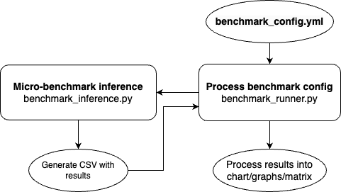

# Microbenchmarks

This directory contains microbenchmarking tools for measuring inference performance across different quantization methods and model architectures.

## Overview

The microbenchmarking system works as follows:


## Components



- **benchmark_runner.py**: Main entry point that orchestrates the benchmarking process
- **benchmark_inference.py**: Handles model creation and inference benchmarking
- **benchmark_training.py**: Manages the setup and execution of training benchmarks
- **utils.py**: Contains utility functions and configuration classes
- **test\/**: Test files and sample configurations

## Usage

1. Create a configuration YAML file (see example below)
2. Run the benchmark using:

```bash
python -m benchmarks.microbenchmarks.benchmark_runner --config path/to/config.yml
```

### Example Configuration

```yaml
# Sample configuration for inference benchmarks
benchmark_mode: "inference"
quantization_config_recipe_names:
  - "baseline"
  - "int8wo"
  - "float8wo"
  - "float8dq-tensor"

output_dir: "benchmarks/microbenchmarks/results"

model_params:
  matrix_shapes:
    - name: "custom"
      shapes: [
        [1024, 1024, 1024],  # [m, k, n]
        [2048, 4096, 1024],
        [4096, 4096, 1024]
      ]
  high_precision_dtype: "torch.bfloat16"
  compile: "max-autotune" # Options: "default", "max-autotune", "false"
  device: "cuda"  # Options: "cuda", "mps", "xpu", "cpu"
  model_type: "linear"  # Options: "linear", "ln_linear_sigmoid"
  enable_profiler: true  # Enable standard profiling
  enable_memory_profiler: true  # Enable CUDA memory profiling
```

## Configuration Options

### Profiling Options
- `enable_profiler`: Enable standard PyTorch profiling (default: false)
- `enable_memory_profiler`: Enable CUDA memory profiling (default: false)
  - Only works when device is set to "cuda"
  - Generates memory snapshots before and after inference
  - Creates visualizations of memory usage
  - Outputs are saved in the memory_profiler subdirectory

### Quantization Methods
Currently, quantization string is in same format as the one being passed in llama/generate.py.
- `baseline`: No quantization
- `int8wo`: 8-bit weight-only quantization
- `int4wo-{group_size}`: 4-bit weight-only quantization with specified group size
- `int4wo-{group_size}-hqq`: 4-bit weight-only quantization with HQQ

### Model Types
- `linear`: Simple linear layer
- `ln_linear_<activation>`: LayerNorm + Linear + Activation, where activation can be:
  - `ln_linear_sigmoid`: LayerNorm + Linear + Sigmoid
  - `ln_linear_relu`: LayerNorm + Linear + ReLU
  - `ln_linear_leakyrelu`: LayerNorm + Linear + LeakyReLU
  - `ln_linear_relu6`: LayerNorm + Linear + ReLU6
  - `ln_linear_gelu`: LayerNorm + Linear + GELU
  - `ln_linear_silu`: LayerNorm + Linear + SiLU
  - `ln_linear_hardswish`: LayerNorm + Linear + Hardswish
- `transformer_block`: Transformer block with self-attention and MLP

### Device Options
- `cuda`: NVIDIA GPU
- `xpu`: Intel GPU
- `mps`: Apple Silicon GPU
- `cpu`: CPU fallback

### Shape Generation Options
- `custom`: Manually specify shapes as a list of [m, k, n] dimensions
  ```yaml
  matrix_shapes:
    - name: "custom"
      shapes: [
        [1024, 1024, 1024],  # [m, k, n]
        [2048, 4096, 1024]
      ]
  ```

- `llama`: Use LLaMa 2 70B single-node weight shapes (assumes fused attn.wqkv and ffn.w13)
  - Generates shapes for: "attn.wqkv", "attn.w0", "ffn.w13", "ffn.w2"
  ```yaml
  matrix_shapes:
    - name: "llama"
  ```

- `pow2`: Generate shapes with dimensions that are powers of 2
  - Parameters:
    - `min_power`: Minimum power of 2 (default: 10, which is 1024)
    - `max_power`: Maximum power of 2 (default: 14, which is 16,384)
  ```yaml
  matrix_shapes:
    - name: "pow2"
      min_power: 10  # 2^10 = 1024
      max_power: 12  # 2^12 = 4096
  ```

- `pow2_extended`: Generate shapes with dimensions that are powers of 2 and powers of 2 + half
  - Parameters:
    - `min_power`: Minimum power of 2 (default: 10, which is 1024)
    - `max_power`: Maximum power of 2 (default: 14, which is 16,384)
  ```yaml
  matrix_shapes:
    - name: "pow2_extended"
      min_power: 10  # Generates: 1024, 1536, 2048, 3072, etc.
      max_power: 11
  ```

- `sweep`: Generate a sweep of shapes with different powers of 2 for M, K, N dimensions
  - Parameters:
    - `min_power`: Minimum power of 2 (default: 8, which is 256)
    - `max_power`: Maximum power of 2 (default: 15, which is 32,768)
  - Note: This generates all combinations of M, K, N dimensions, which can be a large number of shapes
  ```yaml
  matrix_shapes:
    - name: "sweep"
      min_power: 8  # 2^8 = 256
      max_power: 9  # 2^9 = 512
  ```

## Output

Results are saved to a CSV file in the specified output directory

## Running Tests

To run the test suite:

```bash
python -m unittest discover benchmarks/microbenchmarks/test
```

# Training Microbenchmarks

This directory contains tools for benchmarking training performance with low precision datatypes like float8.

## Overview

The training microbenchmarking framework allows you to:

1. Benchmark forward and backward pass performance of models with different precision types
2. Compare float8 training performance against baseline implementations
3. Configure various float8 training parameters (scaling types, granularity, etc.)
4. Measure speedups and performance characteristics
5. Generate detailed profiling information

## Usage

### Running Training Benchmarks

To run training benchmarks, use the benchmark_runner.py script with a training configuration file:

```bash
python -m benchmarks.microbenchmarks.benchmark_runner --config benchmarks/microbenchmarks/test/training_benchmark_config.yml
```

### Configuration File Format

The training benchmark configuration file uses YAML format. Here's an example:

```yaml
# Configuration for training benchmarks with float8 and other low precision dtypes
benchmark_mode: "training"
output_dir: "benchmarks/microbenchmarks/results/training"

# Float8 training specific configurations
quantization_config_recipe_names:
  - "float8dq-tensor"
  - "float8dq-row"
  - "baseline"  # Always include baseline for comparison

# Float8 training specific configurations

# Training specific configurations
scaling_type_input: "dynamic"
scaling_type_weight: "dynamic"
scaling_type_grad_output: "dynamic"
scaling_granularity: "tensorwise"
use_fast_accum: true
repeat_n: 100  # Number of iterations for benchmarking

model_params:
  - name: "float8_linear_training"
    matrix_shapes:
      - name: "custom"
        shapes: [
          [1024, 1024, 1024],  # [m, k, n]
          [2048, 4096, 1024],
          [4096, 4096, 1024]
        ]
    high_precision_dtype: "torch.bfloat16"
    use_torch_compile: true
    torch_compile_mode: "default"
    device: "cuda"
    model_type: "linear"
    enable_profiler: true
    enable_memory_profiler: true
```

### Configuration Options

#### General Options

- `benchmark_mode`: Must be set to "training" for training benchmarks
- `output_dir`: Directory where benchmark results will be saved
- `quantization_config_recipe_names`: List of quantization methods to benchmark

#### Float8 Training Specific Options

- `scaling_type_input`: Scaling type for input tensors ("dynamic" or "disabled")
- `scaling_type_weight`: Scaling type for weight tensors ("dynamic" or "disabled")
- `scaling_type_grad_output`: Scaling type for gradient output tensors ("dynamic" or "disabled")
- `scaling_granularity`: Scaling granularity ("tensorwise", "rowwise", or "columnwise")
- `use_fast_accum`: Whether to use fast accumulation (boolean)
- `repeat_n`: Number of iterations for benchmarking

#### Model Parameters

Each model configuration can include:

- `name`: Name of the benchmark
- `matrix_shapes`: Matrix shapes to benchmark
  - `custom`: Custom shapes as [m, k, n] lists
  - `llama`: Predefined LLaMA model shapes
  - `pow2`: Powers of 2 shapes
- `high_precision_dtype`: High precision dtype (e.g., "torch.bfloat16")
- `use_torch_compile`: Whether to use torch.compile
- `torch_compile_mode`: Compilation mode
- `device`: Device to run on ("cuda" or "cpu")
- `model_type`: Type of model ("linear", "ln_linear_relu", "transformer_block", etc.)
- `enable_profiler`: Whether to enable profiling
- `enable_memory_profiler`: Whether to enable memory profiling

## Extending for New Datatypes

The framework is designed to be easily extended for new datatypes. To add support for a new datatype:

1. Update the `run` function in `benchmark_training.py` to handle the new datatype
2. Add any necessary configuration options to `TrainingBenchmarkConfig`
3. Update the result processing in `TrainingBenchmarkResult` if needed

## Output

The benchmark results include:

- Forward pass time (ms)
- Backward pass time (ms)
- Total training time (ms)
- Speedup compared to baseline
- Scaling configuration details

Results are displayed in a table format and saved to a CSV file in the specified output directory.
