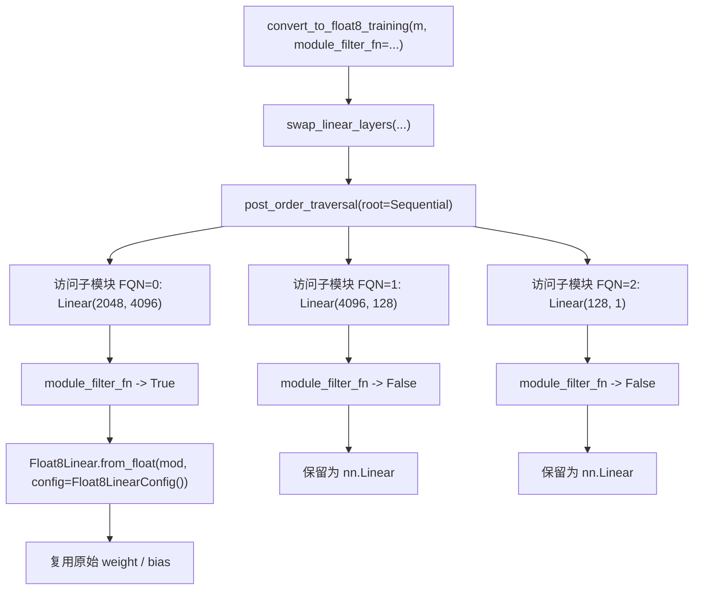
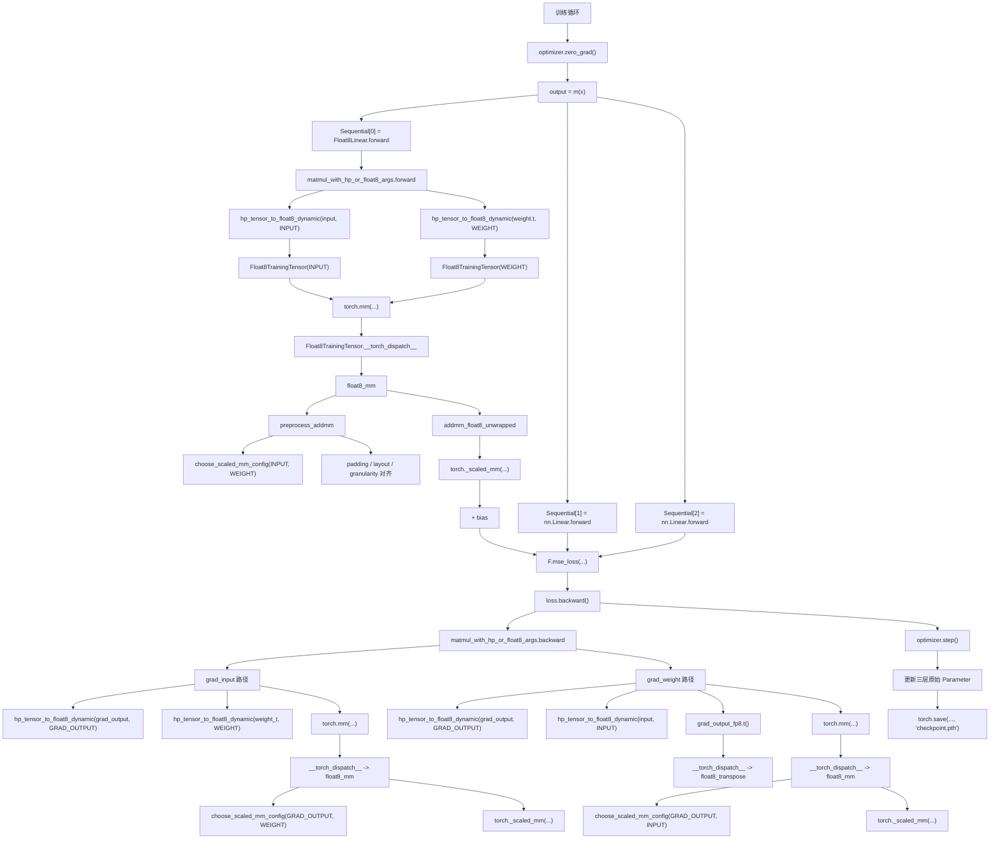

# Float8 训练示例调用关系图

本文基于当前仓库里的实现，对下面这段代码做“按源码推演”的模拟运行说明，不依赖真实 CUDA 执行结果：

```python
import torch
from torch import nn
import torch.nn.functional as F

from torchao.float8.float8_linear_utils import convert_to_float8_training
from torchao.float8.float8_linear import Float8Linear
from torchao.float8 import convert_to_float8_training

m = nn.Sequential(
    nn.Linear(2048, 4096),
    nn.Linear(4096, 128),
    nn.Linear(128, 1),
).bfloat16().cuda()
x = torch.randn(4096, 2048, device="cuda", dtype=torch.bfloat16)
optimizer = torch.optim.AdamW(m.parameters(), lr=1e-3)

def module_filter_fn(mod: torch.nn.Module, fqn: str):
    if fqn == "1":
        return False
    if isinstance(mod, torch.nn.Linear):
        if mod.in_features % 16 != 0 or mod.out_features % 16 != 0:
            return False
    return True

convert_to_float8_training(m, module_filter_fn=module_filter_fn)
```

## 1. 先给结论：这段代码只会把第 0 层换成 `Float8Linear`

| FQN | 原始模块 | 过滤结果 | 转换后 |
| --- | --- | --- | --- |
| `0` | `Linear(2048, 4096)` | 通过，输入/输出维度都能被 16 整除 | `Float8Linear` |
| `1` | `Linear(4096, 128)` | 不通过，因为 `fqn == "1"` | `nn.Linear` |
| `2` | `Linear(128, 1)` | 不通过，因为 `out_features == 1` 不能被 16 整除 | `nn.Linear` |

注意：注释 `# don't convert the last module` 和实际代码不一致。  
在 `nn.Sequential` 里，最后一层的 FQN 是 `2`，不是 `1`。所以这里跳过的是中间层，不是最后一层。

因此，转换后的模型等价于：

```python
m = nn.Sequential(
    Float8Linear(2048, 4096),
    nn.Linear(4096, 128),
    nn.Linear(128, 1),
)
```

补充两点：

- 两个 `convert_to_float8_training` import 最终指向同一个实现，后面的 `from torchao.float8 import convert_to_float8_training` 会覆盖前一个绑定。
- `optimizer` 虽然在模块替换前创建，但仍然有效，因为 `Float8Linear.from_float(...)` 复用了原始 `weight` / `bias` 参数对象。

## 2. 模块替换阶段调用图



`Float8LinearConfig()` 默认等价于 tensorwise recipe，关键点是：

- `input` / `weight` 动态转成 float8，默认目标 dtype 是 `e4m3`
- `grad_output` 动态转成 float8，默认目标 dtype 是 `e5m2`
- forward 对应的 output GEMM 开启 `use_fast_accum=True`
- `pad_inner_dim=False`
- `emulate=False`

## 3. 一次训练迭代的模拟执行

### 3.1 前向阶段

```text
optimizer.zero_grad()

output = m(x)
  -> nn.Sequential.forward
    -> layer[0]: Float8Linear.forward(x)
      -> matmul_with_hp_or_float8_args.apply(
           input=x,
           weight_t=self.weight.t(),
           linear_mm_config=self.linear_mm_config,
           config=self.config,
         )
        -> matmul_with_hp_or_float8_args.forward
          -> hp_tensor_to_float8_dynamic(input_hp, role=INPUT)
            -> tensor_to_scale(...)
            -> hp_tensor_and_scale_to_float8(...)
              -> _ToFloat8ConstrFunc.forward(...)
                -> Float8TrainingTensor(data, scale, orig_dtype=bf16, role=INPUT)
          -> hp_tensor_to_float8_dynamic(weight_hp_t, role=WEIGHT)
            -> tensor_to_scale(...)
            -> hp_tensor_and_scale_to_float8(...)
              -> _ToFloat8ConstrFunc.forward(...)
                -> Float8TrainingTensor(data, scale, orig_dtype=bf16, role=WEIGHT)
          -> torch.mm(fp8_input_2d, fp8_weight_t)
            -> Float8TrainingTensor.__torch_dispatch__
              -> FLOAT8_OPS_TABLE[aten.mm.default]
                -> float8_mm
                  -> preprocess_addmm
                    -> choose_scaled_mm_config(INPUT, WEIGHT)
                    -> padding / layout / granularity 对齐
                  -> addmm_float8_unwrapped
                    -> torch._scaled_mm(...)
          -> reshape 回原始 batch 形状
      -> output + bias
    -> layer[1]: nn.Linear.forward(...)
    -> layer[2]: nn.Linear.forward(...)

fake_labels = torch.ones_like(output)
loss = F.mse_loss(output, fake_labels)
```

这一段里，第 0 层会走 Float8 路径，第 1、2 层仍然是普通 PyTorch `Linear` 路径。

### 3.2 反向阶段

```text
loss.backward()
  -> layer[2] 普通 nn.Linear backward
  -> layer[1] 普通 nn.Linear backward
  -> layer[0] matmul_with_hp_or_float8_args.backward
    -> 计算 grad_input
      -> hp_tensor_to_float8_dynamic(grad_output, role=GRAD_OUTPUT)
      -> hp_tensor_to_float8_dynamic(weight_t, role=WEIGHT)
      -> weight_t_fp8.t()
        -> Float8TrainingTensor.__torch_dispatch__
          -> float8_transpose
      -> torch.mm(fp8_grad_output, fp8_weight)
        -> Float8TrainingTensor.__torch_dispatch__
          -> float8_mm
            -> choose_scaled_mm_config(GRAD_OUTPUT, WEIGHT)
            -> preprocess_addmm
            -> torch._scaled_mm(...)
    -> 计算 grad_weight
      -> hp_tensor_to_float8_dynamic(grad_output, role=GRAD_OUTPUT)
      -> hp_tensor_to_float8_dynamic(input, role=INPUT)
      -> grad_output_fp8.t()
        -> Float8TrainingTensor.__torch_dispatch__
          -> float8_transpose
      -> torch.mm(fp8_grad_output_t, fp8_input)
        -> Float8TrainingTensor.__torch_dispatch__
          -> float8_mm
            -> choose_scaled_mm_config(GRAD_OUTPUT, INPUT)
            -> preprocess_addmm
            -> torch._scaled_mm(...)

optimizer.step()
```

## 4. 合并后的主调用关系图



## 5. 和示例图相比，哪些点需要特别说明

### 5.1 这段代码里的 Float8 主链命中的是 `float8_mm`，不是 `float8_addmm`

`Float8Linear.forward()` 当前实现是：

1. 先调用 `matmul_with_hp_or_float8_args.apply(...)`
2. 在里面执行 `torch.mm(...)`
3. 回到 `Float8Linear.forward()` 后再单独做 `output + bias`

所以这段示例代码里，第 0 层的 Float8 主链实际是：

```text
Float8Linear.forward
  -> matmul_with_hp_or_float8_args.forward
    -> torch.mm(...)
      -> __torch_dispatch__
        -> float8_mm
          -> preprocess_addmm
          -> addmm_float8_unwrapped
            -> torch._scaled_mm(...)
  -> + bias
```

`float8_addmm` 是同级分支，只有当进入 `aten.addmm.default` 且输入里包含 `Float8TrainingTensor` 时才会命中。  
因此它属于同一套 dispatch 体系的一部分，但不是这段示例代码里第 0 层 forward 的主路径。

### 5.2 NPU fastpath 只在条件满足时才会命中

`float8_mm(...)` / `float8_addmm(...)` 开头都会检查：

```text
_should_use_npu_fp8_matmul(...)
```

如果返回 `True`，会改走：

```text
_npu_fp8_matmul(...)
  -> _fp8_npu_matmul(...)
```

否则才走当前更常见的：

```text
preprocess_addmm(...)
  -> addmm_float8_unwrapped(...)
    -> torch._scaled_mm(...)
```

由于示例代码使用的是 `.cuda()`，按常见场景推演，主路径通常是 `torch._scaled_mm(...)` 这一支。

## 6. 最后可直接记住的精简版调用树

```text
convert_to_float8_training
  -> swap_linear_layers
    -> Float8Linear.from_float

训练时：
Sequential.forward
  -> Float8Linear.forward
    -> matmul_with_hp_or_float8_args.forward
      -> hp_tensor_to_float8_dynamic
        -> tensor_to_scale
        -> hp_tensor_and_scale_to_float8
          -> Float8TrainingTensor
      -> torch.mm
        -> Float8TrainingTensor.__torch_dispatch__
          -> float8_mm
            -> preprocess_addmm
              -> choose_scaled_mm_config
            -> addmm_float8_unwrapped
              -> torch._scaled_mm
  -> nn.Linear.forward
  -> nn.Linear.forward

loss.backward
  -> matmul_with_hp_or_float8_args.backward
    -> torch.mm
      -> Float8TrainingTensor.__torch_dispatch__
        -> float8_mm
          -> choose_scaled_mm_config
          -> torch._scaled_mm

optimizer.step
torch.save
```
