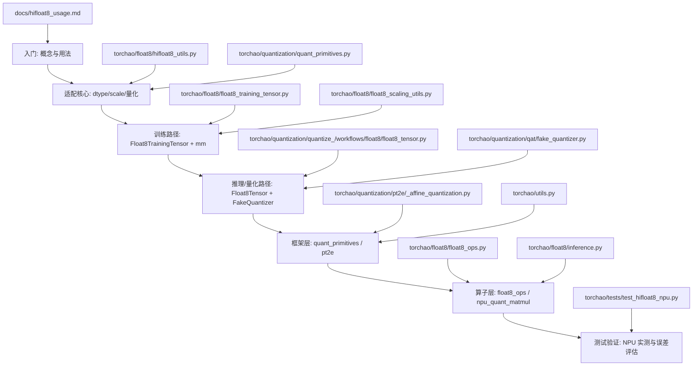

# HiFloat8 适配与 TorchAO 编程入门学习路径

本文面向希望理解 **HiFloat8 适配** 以及 **TorchAO 框架编程** 的同学，给出一条从“使用者”到“实现者”的代码学习路径，并标注关键文件、核心流程与重点代码作用。建议结合代码边读边跑对应测试。

## 学习路径图（Mermaid）

## 代码学习路径（由浅入深）

### 1) 使用者视角：如何调用 HiFloat8
- 文件：
  - `/Users/wangzhenwu/Desktop/code/GitHub/ao/docs/hifloat8_usage.md`
- 重点：
  - `Float8Tensor.from_hp`：高精度张量转 HiFloat8
  - `hp_tensor_to_float8_dynamic`：训练时动态缩放
  - `Float8FakeQuantizer`：QAT 场景
- 价值：
  - 理解最短路径（如何正确“用起来”）

### 2) dtype 识别与 scale 计算（适配关键）
- 文件：
  - `/Users/wangzhenwu/Desktop/code/GitHub/ao/torchao/float8/hifloat8_utils.py`
  - `/Users/wangzhenwu/Desktop/code/GitHub/ao/torchao/quantization/quant_primitives.py`
- 重点代码与作用：
  - `is_hifloat8_dtype` / `_looks_like_hifloat8_dtype`
    - TorchNPU 的 `hifloat8` 不是 `torch.dtype`，不能直接走 `torch.finfo`。
  - `_choose_scale_float8_impl`
    - **Python 侧 scale 计算**，绕过 `torch.library` dtype schema 转换。
  - `_get_float8_max`
    - 对 `hifloat8` 使用 `hifloat8_max_abs`，避免 `torch.finfo` 报错。
- 处理流程：
  1. 识别 hifloat8 dtype
  2. 选择 Python 路径计算 scale
  3. 进入量化/反量化

### 3) 训练路径：Float8TrainingTensor 与 mm
- 文件：
  - `/Users/wangzhenwu/Desktop/code/GitHub/ao/torchao/float8/float8_training_tensor.py`
  - `/Users/wangzhenwu/Desktop/code/GitHub/ao/torchao/float8/float8_scaling_utils.py`
  - `/Users/wangzhenwu/Desktop/code/GitHub/ao/torchao/float8/float8_ops.py`
- 重点代码与作用：
  - `hp_tensor_to_float8_dynamic`
    - 动态计算 scale 后生成 `Float8TrainingTensor`
  - `Float8TrainingTensor.__torch_dispatch__`
    - 统一拦截 `mm/addmm`，转入 float8 op 表
  - `_hif8_npu_matmul`
    - 真正调用 `torch_npu.npu_quant_matmul`
- 处理流程：
  1. 高精度张量 -> scale -> float8 tensor
  2. `torch.mm` 触发 `Float8TrainingTensor` dispatch
  3. 若 hifloat8，调用 `npu_quant_matmul`

### 4) 推理/量化路径：Float8Tensor 与 FakeQuantizer
- 文件：
  - `/Users/wangzhenwu/Desktop/code/GitHub/ao/torchao/quantization/quantize_/workflows/float8/float8_tensor.py`
  - `/Users/wangzhenwu/Desktop/code/GitHub/ao/torchao/quantization/qat/fake_quantizer.py`
- 重点代码与作用：
  - `Float8Tensor.from_hp`
    - hifloat8 走 `_choose_scale_float8_impl`，避免 schema 转换问题
  - `Float8FakeQuantizer.forward`
    - QAT 场景相同逻辑
- 处理流程：
  1. 选择 granularity
  2. 计算 scale
  3. `_quantize_affine_float8` + `_dequantize_affine_float8`

### 5) 框架层：quant_primitives / pt2e
- 文件：
  - `/Users/wangzhenwu/Desktop/code/GitHub/ao/torchao/quantization/quant_primitives.py`
  - `/Users/wangzhenwu/Desktop/code/GitHub/ao/torchao/quantization/pt2e/_affine_quantization.py`
  - `/Users/wangzhenwu/Desktop/code/GitHub/ao/torchao/utils.py`
- 重点：
  - `quant_primitives` 是“标准化量化算子集合”
  - `pt2e` 用于编译/图模式的量化路径
  - `_register_custom_op` 说明了 torch.library 的机制与限制

### 6) NPU 实测与误差验证
- 文件：
  - `/Users/wangzhenwu/Desktop/code/GitHub/ao/torchao/tests/test_hifloat8_npu.py`
- 重点：
  - `test_hifloat8_npu_matmul_numerics`：真实 NPU 上的误差评估
  - 推荐用 “反量化后的浮点值” 作为参考输出

## 建议的学习顺序（可直接照着走）

1. 先跑示例：`docs/hifloat8_usage.md`
2. 理解 dtype/scale：`hifloat8_utils.py` + `quant_primitives.py`
3. 训练路径：`float8_training_tensor.py` + `float8_ops.py`
4. 推理路径：`float8_tensor.py` + `fake_quantizer.py`
5. 框架层理解：`quant_primitives.py` + `pt2e/_affine_quantization.py`
6. 实测验证：`test_hifloat8_npu.py`

## 典型处理流程（文字版）

1. 用户调用 `Float8Tensor.from_hp` 或 `hp_tensor_to_float8_dynamic`
2. 如果 dtype 是 `torch_npu.hifloat8`：
   - 走 `_choose_scale_float8_impl`
   - 走 `to_hifloat8` / `npu_quant_matmul`
3. `torch.mm` 触发 `Float8TrainingTensor.__torch_dispatch__`
4. `float8_ops` 判断 hifloat8，调用 `torch_npu.npu_quant_matmul`
5. 产出输出并可做误差评估

---

如果你希望我再补一版“源码阅读 checklist”或“从 add kernel 到 test 的开发路径”，告诉我你更关注的方向（性能、数值、图模式等）。 
