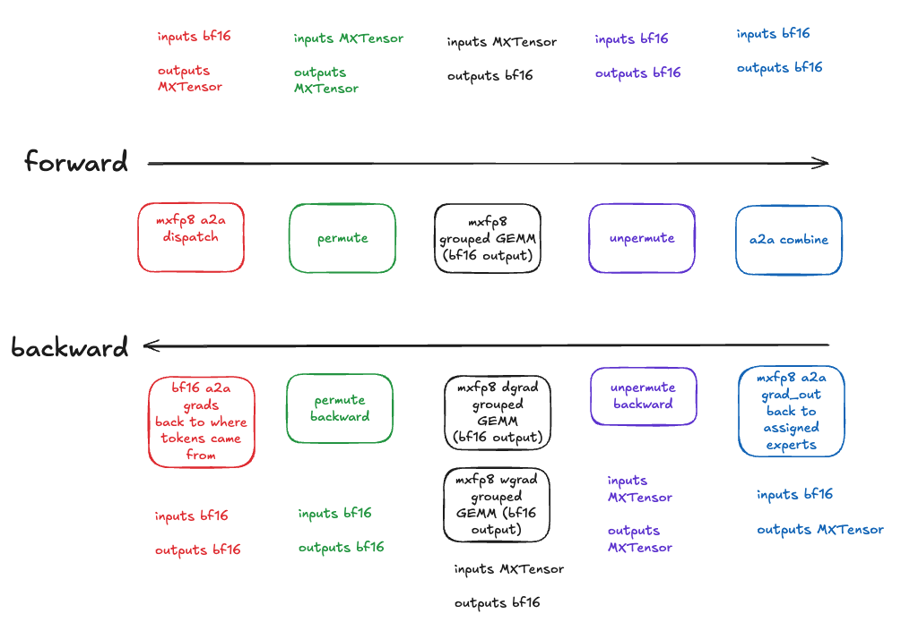

MXFP8 Expert Parallel Training
================================

This tutorial demonstrates how to train Mixture-of-Experts (MoE) models using MXFP8 (Microscaling FP8) with Expert Parallelism. MXFP8 expert parallel training enables efficient distributed training of large MoE models by:

1. Sharding experts across GPUs with expert parallelism (EP)
2. Using MXFP8 quantization during all-to-all communication and expert computation

This approach achieves 10% - 25% tokens/second speedup for DeepSeekV3 16b training:

* +10% tokens/second on single node 8xB200 with NVLink intra-node networking for inter-device communication.
* +25% tokens/second on multi-node B200 cluster with IB inter-node networking and NVLink intra-node networking.

In this tutorial, we will show 2 ways to use MXFP8 expert parallel training:

1. :ref:`Training with torchtitan`, using torchtitan's native integration with torchao.
2. :ref:`Training with torchao directly`, to integrate MXFP8 expert parallelism into your own training code.

MXFP8 Expert Parallel APIs
--------------------------

The key torchao APIs for MXFP8 expert parallelism are located in :code:`torchao.prototype.moe_training.ep`.

These are all differentiable autograd functions which can be chained together:

* :code:`a2a_dispatch_mxfp8_fwd_hp_bwd`: All-to-all token dispatch (MXFP8 forward pass, BF16 backward pass)
* :code:`permute_mxfp8_fwd_hp_bwd`: Permute and pad tokens for MXFP8 computation (MXFP8 forward pass, BF16 backward pass)
* :code:`_to_mxfp8_then_scaled_grouped_mm`: MXFP8 grouped GEMM for routed expert computation (accepts pre-quantized inputs, or dynamically quantizes high precision inputs). Produces bfloat16 output.
* :code:`unpermute_hp_fwd_mxfp8_bwd`: Unpermute tokens back to original order (BF16 forward pass, MXFP8 backward pass)
* :code:`a2a_combine_hp_fwd_mxfp8_bwd`: All-to-all token combine (BF16 forward pass, MXFP8 backward pass). Note the actual combine/aggregation op does not happen here, the naming is just to indicate it is intended to be used for the all2all immediatley preceding the aggregation.

These autograd functions handle the communication and quantization patterns needed for efficient expert parallel training.

Training with torchtitan
------------------------

In this tutorial we'll train a DeepSeek-V3-16B model using torchtitan with torchao's MXFP8 expert parallel recipe.

`Torchtitan <https://github.com/pytorch/torchtitan/>`__ is PyTorch's official pre-training framework that is natively integrated with torchao. For MoE models, torchtitan supports expert parallelism combined with other forms of parallelism like FSDP and tensor parallelism.

.. _mxfp8-torchtitan-prerequisites:

Prerequisites
^^^^^^^^^^^^^

1. (Recommended) Create a new virtual environment with conda or venv.
2. `Install PyTorch <https://pytorch.org/get-started/locally/>`__ 2.10 or nightly build with CUDA 12.8+ support.
3. `Install torchao <https://github.com/pytorch/ao/tree/main?tab=readme-ov-file#installation>`__ nightly build (required for CUDA 12.8+ support).
4. `Install torchtitan <https://github.com/pytorch/torchtitan/tree/main?tab=readme-ov-file#installation>`__, including the "downloading a tokenizer" step.

You're now ready to start a training job with MXFP8 expert parallel!

MXFP8 Expert Parallel Training
^^^^^^^^^^^^^^^^^^^^^^^^^^^^^^^

Run the following command from torchtitan root directory to launch a DeepSeek-V3-16B training job on 8 B200 GPUs with MXFP8 expert parallel training:

.. code:: console

    CONFIG_FILE=/home/dev/torchtitan/torchtitan/models/deepseek_v3/train_configs/deepseek_v3_16b.toml ./run_train.sh \
        --metrics.log_freq=10 \
        --training.steps=1500 \
        --parallelism.data_parallel_shard_degree=8 \
        --parallelism.expert_parallel_degree=8 \
        --parallelism.tensor_parallel_degree=1 \
        --parallelism.expert_tensor_parallel_degree=1 \
        --training.seq_len=8192 \
        --activation_checkpoint.mode=full \
        --model.print_after_conversion \
        --training.local_batch_size=16 \
        --quantize.linear.mx.mxfp8_dim0_cast_kernel_choice="triton" \
        --quantize.linear.mx.mxfp8_dim1_cast_kernel_choice="cuda" \
        --quantize.grouped_mm.mx.fqns="experts" \
        --quantize.grouped_mm.mx.recipe_name="mxfp8_wgrad_with_hp" \
        --compile.enable \
        --compile.components="model,loss" \
        --debug.moe_force_load_balance \
        --model.converters="quantize.grouped_mm.mx"

Understanding the Configuration
^^^^^^^^^^^^^^^^^^^^^^^^^^^^^^^^

Let's break down the key parameters for MXFP8 expert parallel training:

**Parallelism Configuration:**

- :code:`--parallelism.data_parallel_shard_degree=8`: Use 8-way FSDP data parallelism
- :code:`--parallelism.expert_parallel_degree=8`: Shard experts across 8 GPUs
- :code:`--parallelism.tensor_parallel_degree=1`: No tensor parallelism (can be combined if needed)
- :code:`--parallelism.expert_tensor_parallel_degree=1`: No expert-specific tensor parallelism

**MXFP8 Quantization Configuration:**

- :code:`--quantize.grouped_mm.mx.fqns="experts"`: Apply MXFP8 to expert layers only
- :code:`--quantize.grouped_mm.mx.recipe_name="mxfp8_wgrad_with_hp"`: Use the weight-gradient recipe with high precision accumulation. This also automatically applies MXFP8 all-to-all the forward token dispatch, and MXFP8 all-to-all for the backward of combine.
- :code:`--quantize.linear.mx.mxfp8_dim0_cast_kernel_choice="triton"`: Use Triton kernel for dimension 0 casting
- :code:`--quantize.linear.mx.mxfp8_dim1_cast_kernel_choice="cuda"`: Use CUDA kernel for dimension 1 casting

**Other Important Settings:**

- :code:`--model.converters="quantize.grouped_mm.mx"`: Apply the grouped MM MXFP8 converter to the model
- :code:`--compile.enable --compile.components="model,loss"`: Enable torch.compile for optimal performance
- :code:`--debug.moe_force_load_balance`: Force balanced load distribution across experts (useful for debugging)

Expected Output
^^^^^^^^^^^^^^^

You should see terminal output similar to this:

.. code:: console

    [rank0]:[titan] 2026-01-29 10:15:32,145 - root - INFO - step:   1  loss: 11.8432  memory: 45.23GiB(47.65%)  tps: 512
    [rank0]:[titan] 2026-01-29 10:15:45,267 - root - INFO - step:  10  loss:  9.3421  memory: 48.91GiB(51.52%)  tps: 21,734
    [rank0]:[titan] 2026-01-29 10:15:58,891 - root - INFO - step:  20  loss:  7.8234  memory: 48.91GiB(51.52%)  tps: 21,902
    [rank0]:[titan] 2026-01-29 10:16:12,523 - root - INFO - step:  30  loss:  6.9123  memory: 48.91GiB(51.52%)  tps: 21,511

Recipe Selection: MXFP8 Weight Gradient with High Precision
^^^^^^^^^^^^^^^^^^^^^^^^^^^^^^^^^^^^^^^^^^^^^^^^^^^^^^^^^^^^

The :code:`mxfp8_wgrad_with_hp` recipe is required for MoE training with expert parallelism. Key characteristics:

* **Forward output**: MXFP8 grouped GEMM
* **Input gradient**: MXFP8 grouped GEMM
* **Weight gradient**: BF16 grouped GEMM - this trades off some performance for improved numerical accuracy for weight gradients.

This recipe is required for MXFP8 expert parallelism in the current prototype implementation.

**Optional note for the interested reader for why this is required**: This is because the input activations come into the `forward` method pre-quantized along dim zero (1x32 scaling factors), for the `out = input @ weight.transpose(-2,-1)` grouped GEMM.
When we save those input activations for the backward pass, they are scaled along a different dimension than what we need for the gradient of the weight computation,
`wgrad = grad_out.t() @ input`, where they will be the right-hand side operand and thus need to be scaled along dim one (32x1 scaling factors). To support MXFP8 Grouped GEMM for the weight gradient,
we would need to *dequantize* the input along dim 0 then *requantize* along dim 1. This (1) would add some overhead, and (2) could impact numerics, so for the v0 implementation of this feature,
we stick with requiring `wgrad_with_hp` recipe which avoids this issue entirely by doing the weight gradient grouped GEMM in bfloat16.

Combining with Other Parallelism Strategies
^^^^^^^^^^^^^^^^^^^^^^^^^^^^^^^^^^^^^^^^^^^^

MXFP8 expert parallel can be combined with other parallelism techniques:

**With Tensor Parallelism:**

.. code:: console

    # Add tensor parallelism for larger models
    --parallelism.tensor_parallel_degree=2 \
    --parallelism.expert_parallel_degree=4

Given the trend toward granular experts and increased sparsity, where achieving good GEMM efficiency is already difficult,
we recommend against applying tensor parallel to the routed experts, but other layers like attention or dense FFNs are fine.

**With Pipeline Parallelism:**

.. code:: console

    # Add pipeline parallelism (if supported by your model)
    --parallelism.pipeline_parallel_degree=2

See the `torchtitan docs <https://github.com/pytorch/torchtitan/tree/main>`__ for more details.

**Important Notes**

* MXFP8 expert parallel training requires a nightly build of torchao with CUDA 12.8+ support
* The :code:`wgrad_with_hp` recipe is currently required for MXFP8 expert parallelism
* We recommend :code:`--compile.enable --compile.components="model,loss"` for competitive performance
* For benchmarking, lbalancing across experts is critical to ensure valid 1:1 comparisons - use :code:`--debug.moe_force_load_balance` during development to ensure balanced workloads

Training with torchao directly
-------------------------------

In this tutorial we'll apply MXFP8 expert parallelism to a custom MoE layer using torchao APIs directly.

You can use this workflow to integrate MXFP8 expert parallelism into your own custom training code.

.. _mxfp8-torchao-prerequisites:

Prerequisites
^^^^^^^^^^^^^

1. (Recommended) Create a new virtual environment with conda or venv.
2. `Install torchao <https://github.com/pytorch/ao/tree/main?tab=readme-ov-file#installation>`__ nightly build (required for CUDA 12.8+ support).

You're now ready to integrate MXFP8 expert parallel primitives into your training code directly!

**Part 1:** Defining a simplified MoE layer

Using the `TorchTitan MoE implementation <https://github.com/pytorch/torchtitan/blob/main/torchtitan/models/moe/moe.py>`__ as a reference,
we define a simplified MoE layer without a real router (we will use fake token-expert affinity scores later).

Key requirements:

* Expert weights must be implemented as a 3d nn.Parameter so we can use a grouped GEMM for computation.
* Use :code:`_to_mxfp8_then_scaled_grouped_mm` from :code:`torchao.prototype.moe_training.scaled_grouped_mm` to do the routed expert computation.

.. code:: py

    class GroupedExperts(nn.Module):
        """Grouped experts module that processes tokens with grouped matrix multiplication."""

        def __init__(self, dim: int, hidden_dim: int, num_experts: int):
            super().__init__()
            self.num_experts = num_experts
            self.w1 = nn.Parameter(torch.empty(num_experts, hidden_dim, dim))
            self.w2 = nn.Parameter(torch.empty(num_experts, dim, hidden_dim))
            self.w3 = nn.Parameter(torch.empty(num_experts, hidden_dim, dim))

        def forward(
            self,
            x: torch.Tensor,
            num_tokens_per_expert: torch.Tensor,
        ) -> torch.Tensor:

            # Convert from DTensor to local tensor if needed (for EP)
            if isinstance(self.w1, DTensor):
                w1, w2, w3 = self.w1.to_local(), self.w2.to_local(), self.w3.to_local()
            else:
                w1, w2, w3 = self.w1, self.w2, self.w3

            # Compute offsets for grouped matrix multiplication
            offsets = torch.cumsum(num_tokens_per_expert, dim=0, dtype=torch.int32)

            # Expert computation using MXFP8 grouped matrix multiplication.

            # Use this torchao autograd function that optionally accepts
            # MXTensor inputs (pre-quantized prior to the all2all - shown later)
            # to use MXFP8 grouped GEMM, for ~2x speedup over BF16 grouped GEMM!
            # The `wgrad_with_hp` recipe required for MXFP8 expert parallelism (more details later in the tutorial)
            from torchao.prototype.moe_training.scaled_grouped_mm import (
                _to_mxfp8_then_scaled_grouped_mm as mxfp8_gmm,
            )
            h = F.silu(mxfp8_gmm(x, w1.transpose(-2, -1), offs=offsets, wgrad_with_hp=True))
            h = h * mxfp8_gmm(x, w3.transpose(-2, -1), offs=offsets, wgrad_with_hp=True)
            output = mxfp8_gmm(h, w2.transpose(-2, -1), offs=offsets, wgrad_with_hp=True)
            return output.type_as(x)

    class SimplifiedMoE(nn.Module):
        """Simplified MoE layer for demonstration purposes."""

        def __init__(self, dim: int, hidden_dim: int, num_experts: int):
            super().__init__()
            self.num_experts = num_experts
            self.experts = GroupedExperts(dim, hidden_dim, num_experts)

        def forward(
            self,
            routed_input: torch.Tensor,
            num_tokens_per_expert: torch.Tensor,
        ) -> torch.Tensor:
            return self.experts(routed_input, num_tokens_per_expert)

**Part 2**: MXFP8 Expert Parallelism

Next, we will define a `ParallelStyle <https://github.com/pytorch/pytorch/blob/5d1599cfa64659f11880c0c867ca13e9e3d8fbed/torch/distributed/tensor/parallel/style.py#L31>`__ subclass
which uses torchao MXFP8 expert parallel autograd functions.

.. code:: py

    # Use torchao mxfp8 autograd functions as building blocks
    # to define custom MXFP8 Expert Parallel implementation!
    from torchao.prototype.moe_training.ep import (
        a2a_combine_hp_fwd_mxfp8_bwd,
        a2a_dispatch_mxfp8_fwd_hp_bwd,
        permute_mxfp8_fwd_hp_bwd,
        unpermute_hp_fwd_mxfp8_bwd,
    )

    class MXFP8ExpertParallel(ParallelStyle):
        """Custom ParallelStyle for MXFP8 Expert Parallelism."""

        def __init__(self):
            super().__init__()
            self.input_splits = None
            self.output_splits = None
            self.input_shape = None
            self.permuted_indices = None

        def _partition_fn(self, name: str, mod: nn.Module, device_mesh: DeviceMesh) -> None:
            """Shard expert parameters along the expert dimension."""
            for param_name, param in mod.named_parameters(recurse=False):
                # Experts are 3D parameters of shape (num_experts, ..., ...)
                # Shard along the first dimension (expert dimension)
                dist_param = nn.Parameter(distribute_tensor(param, device_mesh, [Shard(0)]))
                mod.register_parameter(param_name, dist_param)

        def _token_dispatch(
            self, mod: nn.Module, inputs: tuple, device_mesh: DeviceMesh
        ) -> tuple[torch.Tensor, torch.Tensor]:
            """
            Dispatch tokens to appropriate experts using MXFP8 all-to-all communication.

            This involves:
            1. All-to-all to distribute tokens to the correct EP rank
            2. Permutation to arrange tokens in the correct order for grouped computation
            3. Padding to ensure token counts are multiples of MXFP8 block size (32)
            """
            routed_input, num_tokens_per_expert = inputs
            ep_degree = device_mesh.shape[0]
            num_local_experts = num_tokens_per_expert.shape[0] // ep_degree

            # First all-to-all to calculate output splits from input splits
            with torch.no_grad():
                num_tokens_per_expert_group = all_to_all_single(
                    num_tokens_per_expert,
                    None,
                    None,
                    group=device_mesh.get_group(),
                )
                # Wait for async collective to complete
                num_tokens_per_expert_group = torch.ops._c10d_functional.wait_tensor(
                    num_tokens_per_expert_group
                )

                # Calculate input/output splits for all-to-all
                input_splits = (
                    num_tokens_per_expert.view(ep_degree, -1)
                    .sum(dim=1)
                    .to(torch.device("cpu"), non_blocking=True)
                )
                output_splits = (
                    num_tokens_per_expert_group.view(ep_degree, -1)
                    .sum(dim=1)
                    .to(torch.device("cpu"), non_blocking=False)
                )
                self.input_splits = input_splits.tolist()
                self.output_splits = output_splits.tolist()

            # Perform all-to-all token dispatch with MXFP8 forward pass
            # This torchao autograd function quantizes the high precision input activations/tokens,
            # and performs the expensive all-to-all token dispatch in MXFP8, producing MXTensor outputs
            # which the next step can consume!
            # Sending ~1/2 the bytes over the network = speedup!
            # In the backward pass, the incoming upstream gradients will be in BF16, and it routes these
            # output token gradients back to the device they came from.
            routed_input = a2a_dispatch_mxfp8_fwd_hp_bwd(
                routed_input,
                output_splits=self.output_splits,
                input_splits=self.input_splits,
                group_name=device_mesh.get_group().group_name,
            )

            # Permute and pad token groups for MXFP8 computation
            # This torchao autograd function accepts MXTensor inputs produced by the MXFP8 all-to-all,
            # and does the token permutation and padding needed for MXFP8 grouped GEMM (seen in GroupedExperts above).
            # In the backward pass, the incoming upstream gradients will be the BF16 outputs of the MXFP8 grouped GEMM
            # backward pass, so the permutation backward pass also happens in BF16.
            (
                self.input_shape,
                routed_input,
                self.permuted_indices,
                num_tokens_per_expert_group,
                _,
            ) = permute_mxfp8_fwd_hp_bwd(
                routed_input, num_tokens_per_expert_group, ep_degree, num_local_experts
            )
            return routed_input, num_tokens_per_expert_group

        def _token_combine(
            self, mod: nn.Module, routed_output: torch.Tensor, device_mesh: DeviceMesh
        ) -> torch.Tensor:
            """
            Combine expert outputs and route tokens back using MXFP8 all-to-all communication.

            This involves:
            1. Unpermute tokens back to post-dispatch layout
            2. All-to-all to route tokens back to their original EP rank
            """
            # Unpermute tokens
            # This torchao autograd function accepts the BF16 outputs of the MXFP8 grouped GEMM, so the
            # "unpermutation" step (putting tokens back in their original order and removing the padding)
            # happens in BF16 as well.
            # In the backward pass, the incoming upstream gradients will be the MXTensor outputs of the
            # MXFP8 all-to-all combine backward pass, so this unpermute autograd func accepts MXTensor
            # inputs and performs the reordering in MXFP8.
            routed_output = unpermute_hp_fwd_mxfp8_bwd(
                routed_output, self.permuted_indices, self.input_shape
            )

            # Reverse all-to-all to route tokens back
            # This torchao autograd function receives BF16 inputs in the forward pass (from the unpermute step above),
            # and we do the forward all-to-all here for the combine step in BF16. We don't use MXFP8 here because:
            #   1. There is no opportunity to do a MXFP8 grouped GEMM for a big speedup on the other side, we'll have
            #      to just immediately dequantize. This is still a net perf benefit in multi-node EP, however...:
            #   2. We would be introducing a new quantize/dequantize pair (not lossless!) that would not have been present in regular
            #      MXFP8 training with BF16 all-to-alls, which has numerical implications that have not been evaluated yet.
            #      We may support this in the future, but for this initial version, we stay in BF16 for this all-to-all.
            # In the backward pass, we DO quantize to MXFP8 (just moving the quantization for the MXFP8 grouped GEMM backward pass
            # EARLIER - before the all-to-all backward instead of right before the grouped GEMM kernel itself.
            # This is numerically equivalent, and much faster due to low precision comms!)
            routed_output = a2a_combine_hp_fwd_mxfp8_bwd(
                routed_output,
                output_splits=self.input_splits,  # Swap to reverse the dispatch
                input_splits=self.output_splits,
                group_name=device_mesh.get_group().group_name,
            )
            return routed_output

        def _apply(self, module: nn.Module, device_mesh: DeviceMesh) -> nn.Module:
            """Apply the parallel style to the module."""
            return distribute_module(
                module,
                device_mesh,
                partition_fn=self._partition_fn,
                input_fn=self._token_dispatch,
                output_fn=self._token_combine,
            )

    def apply_mxfp8_expert_parallel(moe_layer: SimplifiedMoE, ep_mesh: DeviceMesh):
        """Apply MXFP8ExpertParallel to the MoE layer."""
        experts_plan = MXFP8ExpertParallel()
        parallelize_module(
            module=moe_layer.experts,
            device_mesh=ep_mesh,
            parallelize_plan=experts_plan,
        )

Complete Example
^^^^^^^^^^^^^^^^

Below is a complete example showing how to apply MXFP8 expert parallelism to a simplified MoE layer:

.. code:: py

    #!/usr/bin/env python3
    """
    Standalone example of using MXFP8 Expert Parallel with a simplified MoE layer.

    Usage:
        torchrun --nproc_per_node=2 mxfp8_expert_parallel_example.py
    """

    import os
    import torch
    import torch.nn as nn
    import torch.nn.functional as F
    from torch.distributed import init_process_group, destroy_process_group
    from torch.distributed._functional_collectives import all_to_all_single
    from torch.distributed.device_mesh import DeviceMesh
    from torch.distributed.tensor import DTensor, Shard, distribute_tensor, distribute_module
    from torch.distributed.tensor.parallel import ParallelStyle, parallelize_module

    from torchao.prototype.moe_training.ep import (
        a2a_combine_hp_fwd_mxfp8_bwd,
        a2a_dispatch_mxfp8_fwd_hp_bwd,
        permute_mxfp8_fwd_hp_bwd,
        unpermute_hp_fwd_mxfp8_bwd,
    )

    # ============================================================================
    # Define MoE Components
    # ============================================================================

    class GroupedExperts(nn.Module):
        """Grouped experts module that processes tokens with grouped matrix multiplication."""

        def __init__(self, dim: int, hidden_dim: int, num_experts: int):
            super().__init__()
            self.num_experts = num_experts
            self.w1 = nn.Parameter(torch.empty(num_experts, hidden_dim, dim))
            self.w2 = nn.Parameter(torch.empty(num_experts, dim, hidden_dim))
            self.w3 = nn.Parameter(torch.empty(num_experts, hidden_dim, dim))

        def forward(
            self,
            x: torch.Tensor,
            num_tokens_per_expert: torch.Tensor,
        ) -> torch.Tensor:
            from torchao.prototype.moe_training.mxfp8_grouped_mm import (
                _to_mxfp8_then_scaled_grouped_mm as mxfp8_gmm,
            )

            # Convert from DTensor to local tensor if needed (for EP)
            if isinstance(self.w1, DTensor):
                w1, w2, w3 = self.w1.to_local(), self.w2.to_local(), self.w3.to_local()
            else:
                w1, w2, w3 = self.w1, self.w2, self.w3

            # Compute offsets for grouped matrix multiplication
            offsets = torch.cumsum(num_tokens_per_expert, dim=0, dtype=torch.int32)

            # Expert computation using MXFP8 grouped matrix multiplication
            # wgrad_with_hp recipe required for MXFP8 expert parallelism
            h = F.silu(mxfp8_gmm(x, w1.transpose(-2, -1), offs=offsets, wgrad_with_hp=True))
            h = h * mxfp8_gmm(x, w3.transpose(-2, -1), offs=offsets, wgrad_with_hp=True)
            output = mxfp8_gmm(h, w2.transpose(-2, -1), offs=offsets, wgrad_with_hp=True)
            return output.type_as(x)

    class SimplifiedMoE(nn.Module):
        """Simplified MoE layer for demonstration purposes."""

        def __init__(self, dim: int, hidden_dim: int, num_experts: int):
            super().__init__()
            self.num_experts = num_experts
            self.experts = GroupedExperts(dim, hidden_dim, num_experts)

        def forward(
            self,
            routed_input: torch.Tensor,
            num_tokens_per_expert: torch.Tensor,
        ) -> torch.Tensor:
            return self.experts(routed_input, num_tokens_per_expert)

    # ============================================================================
    # MXFP8 Expert Parallel Implementation
    # ============================================================================

    class MXFP8ExpertParallel(ParallelStyle):
        """Custom ParallelStyle for MXFP8 Expert Parallelism."""

        def __init__(self):
            super().__init__()
            self.input_splits = None
            self.output_splits = None
            self.input_shape = None
            self.permuted_indices = None

            # Use torchao MXFP8 EP autograd functions as building blocks
            self.a2a_dispatch_mxfp8_fwd_hp_bwd = a2a_dispatch_mxfp8_fwd_hp_bwd
            self.permute_mxfp8_fwd_hp_bwd = permute_mxfp8_fwd_hp_bwd
            self.unpermute_hp_fwd_mxfp8_bwd = unpermute_hp_fwd_mxfp8_bwd
            self.a2a_combine_hp_fwd_mxfp8_bwd = a2a_combine_hp_fwd_mxfp8_bwd

        def _partition_fn(self, name: str, mod: nn.Module, device_mesh: DeviceMesh) -> None:
            """Shard expert parameters along the expert dimension."""
            for param_name, param in mod.named_parameters(recurse=False):
                # Experts are 3D parameters of shape (num_experts, ..., ...)
                # Shard along the first dimension (expert dimension)
                dist_param = nn.Parameter(distribute_tensor(param, device_mesh, [Shard(0)]))
                mod.register_parameter(param_name, dist_param)

        def _token_dispatch(
            self, mod: nn.Module, inputs: tuple, device_mesh: DeviceMesh
        ) -> tuple[torch.Tensor, torch.Tensor]:
            """
            Dispatch tokens to appropriate experts using MXFP8 all-to-all communication.

            This involves:
            1. All-to-all to distribute tokens to the correct EP rank
            2. Permutation to arrange tokens in the correct order for grouped computation
            3. Padding to ensure token counts are multiples of MXFP8 block size (32)
            """
            routed_input, num_tokens_per_expert = inputs
            ep_degree = device_mesh.shape[0]
            num_local_experts = num_tokens_per_expert.shape[0] // ep_degree

            # First all-to-all to calculate output splits from input splits
            with torch.no_grad():
                num_tokens_per_expert_group = all_to_all_single(
                    num_tokens_per_expert,
                    None,
                    None,
                    group=device_mesh.get_group(),
                )
                # Wait for async collective to complete
                num_tokens_per_expert_group = torch.ops._c10d_functional.wait_tensor(
                    num_tokens_per_expert_group
                )

                # Calculate input/output splits for all-to-all
                input_splits = (
                    num_tokens_per_expert.view(ep_degree, -1)
                    .sum(dim=1)
                    .to(torch.device("cpu"), non_blocking=True)
                )
                output_splits = (
                    num_tokens_per_expert_group.view(ep_degree, -1)
                    .sum(dim=1)
                    .to(torch.device("cpu"), non_blocking=False)
                )
                self.input_splits = input_splits.tolist()
                self.output_splits = output_splits.tolist()

            # Perform all-to-all token dispatch with MXFP8 forward pass
            routed_input = self.a2a_dispatch_mxfp8_fwd_hp_bwd(
                routed_input,
                output_splits=self.output_splits,
                input_splits=self.input_splits,
                group_name=device_mesh.get_group().group_name,
            )

            # Permute and pad tokens for MXFP8 computation
            (
                self.input_shape,
                routed_input,
                self.permuted_indices,
                num_tokens_per_expert_group,
                _,
            ) = self.permute_mxfp8_fwd_hp_bwd(
                routed_input, num_tokens_per_expert_group, ep_degree, num_local_experts
            )
            return routed_input, num_tokens_per_expert_group

        def _token_combine(
            self, mod: nn.Module, routed_output: torch.Tensor, device_mesh: DeviceMesh
        ) -> torch.Tensor:
            """
            Combine expert outputs and route tokens back using MXFP8 all-to-all communication.

            This involves:
            1. Unpermute tokens back to post-dispatch layout
            2. All-to-all to route tokens back to their original EP rank
            """
            # Unpermute tokens
            routed_output = self.unpermute_hp_fwd_mxfp8_bwd(
                routed_output, self.permuted_indices, self.input_shape
            )

            # Reverse all-to-all to route tokens back
            routed_output = self.a2a_combine_hp_fwd_mxfp8_bwd(
                routed_output,
                output_splits=self.input_splits,  # Swap to reverse the dispatch
                input_splits=self.output_splits,
                group_name=device_mesh.get_group().group_name,
            )
            return routed_output

        def _apply(self, module: nn.Module, device_mesh: DeviceMesh) -> nn.Module:
            """Apply the parallel style to the module."""
            return distribute_module(
                module,
                device_mesh,
                partition_fn=self._partition_fn,
                input_fn=self._token_dispatch,
                output_fn=self._token_combine,
            )

    def apply_mxfp8_expert_parallel(moe_layer: SimplifiedMoE, ep_mesh: DeviceMesh):
        """Apply MXFP8ExpertParallel to the MoE layer."""
        experts_plan = MXFP8ExpertParallel()
        parallelize_module(
            module=moe_layer.experts,
            device_mesh=ep_mesh,
            parallelize_plan=experts_plan,
        )

    # ============================================================================
    # Main Example
    # ============================================================================

    def main():
        # Initialize distributed process group
        init_process_group(backend="nccl")

        local_rank = int(os.environ["LOCAL_RANK"])
        world_size = int(os.environ["WORLD_SIZE"])
        device = torch.device(f"cuda:{local_rank}")
        torch.cuda.set_device(device)

        # Model configuration
        dim = 7168
        hidden_dim = 2048
        num_experts = 32
        num_local_experts = num_experts // world_size
        batch_size = 16
        seq_len = 8192

        # Create device mesh for expert parallelism
        ep_mesh = DeviceMesh("cuda", list(range(world_size)), mesh_dim_names=("ep",))

        # Create MoE layer
        moe = SimplifiedMoE(dim, hidden_dim, num_local_experts).to(device).to(torch.bfloat16)

        # Apply MXFP8 expert parallel
        print(f"[Rank {local_rank}] Applying MXFP8 Expert Parallelism...")
        apply_mxfp8_expert_parallel(moe, ep_mesh)

        # Create sample inputs (in practice, these come from the router)
        num_tokens = batch_size * seq_len
        routed_input = torch.randn(num_tokens, dim, device=device, dtype=torch.bfloat16)
        num_tokens_per_expert = torch.full(
            (num_local_experts,),
            num_tokens // num_local_experts,
            device=device,
            dtype=torch.int64,
        )

        # Forward and backward pass
        print(f"[Rank {local_rank}] Running forward pass...")
        output = moe(routed_input, num_tokens_per_expert)

        print(f"[Rank {local_rank}] Running backward pass...")
        grad_output = torch.randn_like(output)
        output.backward(grad_output)

        destroy_process_group()
        print(f"[Rank {local_rank}] Done!")

    if __name__ == "__main__":
        main()

Running the Example
^^^^^^^^^^^^^^^^^^^

To run the example with 2 GPUs:

.. code:: console

    torchrun --nproc_per_node=2 mxfp8_expert_parallel_example.py

You can scale to more GPUs by adjusting :code:`--nproc_per_node` and ensuring :code:`num_experts` is divisible by :code:`world_size`.

Microbenchmarks
---------------

Comparison Against Full BF16 Baseline
^^^^^^^^^^^^^^^^^^^^^^^^^^^^^^^^^^^^^^

For reference, the table below shows the full end-to-end speedup when comparing MXFP8 expert parallelism against a complete bfloat16 baseline (bfloat16 all-to-all + bfloat16 grouped GEMMs):

* **Baseline (full bf16)**: bfloat16 all-to-all + bfloat16 grouped MM
* **MXFP8 EP**: MXFP8 all-to-all + MXFP8 grouped MM with :code:`wgrad_with_hp=True`

.. code:: console

    Expert Parallelism Pipeline Benchmark Results
    World Size: 8
    ========================================================================================================================
    +----------+-------+--------------+---------------+---------------+----------------+---------------+---------------+----------------+---------------+-----------------+
    |   tokens |   dim |   hidden_dim |   num_experts |   fwd_bf16_ms |   fwd_mxfp8_ms | fwd_speedup   |   bwd_bf16_ms |   bwd_mxfp8_ms | bwd_speedup   | total_speedup   |
    +==========+=======+==============+===============+===============+================+===============+===============+================+===============+=================+
    |   131072 |  8192 |         5120 |             8 |        18.037 |         12.145 | 1.49x         |        30.485 |         21.839 | 1.40x         | 1.43x           |
    +----------+-------+--------------+---------------+---------------+----------------+---------------+---------------+----------------+---------------+-----------------+
    |   131072 |  7168 |         2048 |             8 |         9.394 |          6.424 | 1.46x         |        13.762 |         10.306 | 1.34x         | 1.38x           |
    +----------+-------+--------------+---------------+---------------+----------------+---------------+---------------+----------------+---------------+-----------------+
    |   131072 |  2048 |         1408 |             8 |         3.368 |          2.952 | 1.14x         |         4.982 |          3.877 | 1.29x         | 1.22x           |
    +----------+-------+--------------+---------------+---------------+----------------+---------------+---------------+----------------+---------------+-----------------+

Against a full bfloat16 baseline, MXFP8 expert parallelism achieves **1.22-1.43x total speedup**, with the largest models seeing up to **1.43x speedup**. This demonstrates the combined benefit of using MXFP8 for both communication (all-to-all) and computation (grouped matrix multiplication).

Comparison Against BF16 All-to-Alls + MXFP8 Grouped GEMM
^^^^^^^^^^^^^^^^^^^^^^^^^^^^^^^^^^^^^^^^^^^^^^^^^^^^^^^^^

The table below shows expert parallelism pipeline benchmark results on a single node with 8xB200 GPUs connected via NVL8.
Both configurations use MXFP8 grouped matrix multiplication with :code:`wgrad_with_hp=True`.
The speedup comes from using MXFP8 for all-to-all communications:

* **Baseline (bf16)**: bfloat16 all-to-all + MXFP8 grouped MM with :code:`wgrad_with_hp=True`
* **MXFP8 EP**: MXFP8 all-to-all + MXFP8 grouped MM with :code:`wgrad_with_hp=True`

.. code:: console

    Expert Parallelism Pipeline Benchmark Results
    World Size: 8
    ========================================================================================================================
    +----------+-------+--------------+---------------+---------------+----------------+---------------+---------------+----------------+---------------+-----------------+
    |   tokens |   dim |   hidden_dim |   num_experts |   fwd_bf16_ms |   fwd_mxfp8_ms | fwd_speedup   |   bwd_bf16_ms |   bwd_mxfp8_ms | bwd_speedup   | total_speedup   |
    +==========+=======+==============+===============+===============+================+===============+===============+================+===============+=================+
    |   131072 |  8192 |         5120 |             8 |        14.28  |         12.348 | 1.16x         |        24.812 |         21.897 | 1.13x         | 1.14x           |
    +----------+-------+--------------+---------------+---------------+----------------+---------------+---------------+----------------+---------------+-----------------+
    |   131072 |  7168 |         2048 |             8 |         8.283 |          6.4   | 1.29x         |        12.548 |         10.299 | 1.22x         | 1.25x           |
    +----------+-------+--------------+---------------+---------------+----------------+---------------+---------------+----------------+---------------+-----------------+
    |   131072 |  2048 |         1408 |             8 |         3.278 |          2.913 | 1.13x         |         4.934 |          3.881 | 1.27x         | 1.21x           |
    +----------+-------+--------------+---------------+---------------+----------------+---------------+---------------+----------------+---------------+-----------------+

As shown, using MXFP8 for all-to-all communications achieves **1.14-1.25x total speedup** versus only quantizing directly before the grouped GEMMs.

## Conclusion

In this tutorial we demonstrated how to use TorchAO's differentiable building blocks for MXFP8 MoE training with expert parallelism.

For more details, see the [MXFP8 MoE training docs](https://github.com/pytorch/ao/blob/main/torchao/prototype/moe_training/README.md).
