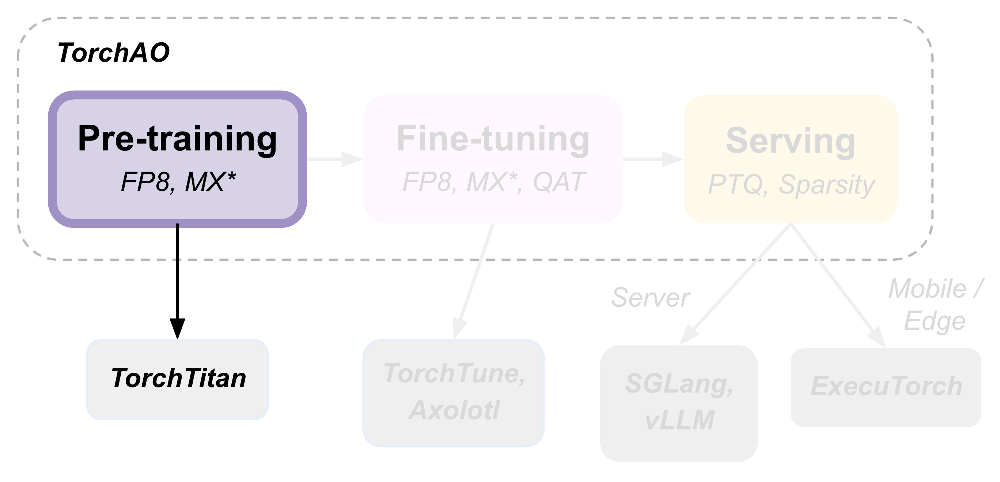
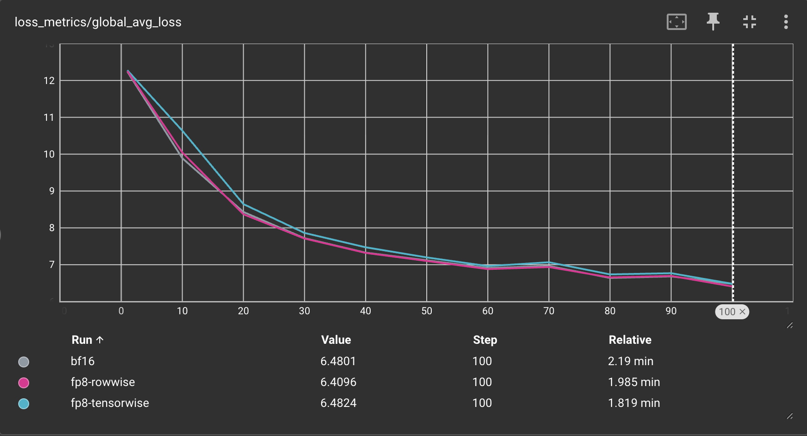

(Part 1) Pre-training with float8
---------------------------------

TorchAO provides an end-to-end pre-training, fine-tuning, and serving
model optimization flow by leveraging our quantization and sparsity
techniques integrated into our partner frameworks. This is part 1 of 3
such tutorials showcasing this end-to-end flow, focusing on the
pre-training step.

Pre-training with float8 using torchao can provide `up to 1.5x speedups <https://pytorch.org/blog/training-using-float8-fsdp2/>`__ on 512 GPU clusters,
and up to `1.34-1.43x speedups <https://pytorch.org/blog/accelerating-large-scale-training-and-convergence-with-pytorch-float8-rowwise-on-crusoe-2k-h200s/>`__ on 2K H200 clusters with the latest `torchao.float8` rowwise recipe.

In this tutorial, we will show 2 ways to use the **torchao.float8** recipes for pre-training:

1. :ref:`Pre-training with torchtitan`, the offical PyTorch pre-training framework with native torchao integration.
2. :ref:`Pre-training with torchao directly`, to integrate torchao's float8 training recipes into your own pre-training code.

Pre-training with torchtitan
###########################

In this tutorial we'll pre-train Llama3-8B using torchtitan with torchao's float8 training recipes: rowwise scaling and tensorwise scaling.

`Torchtitan <https://github.com/pytorch/torchtitan/>`__ is PyTorch's official pre-training framework that is natively integrated with torchao, and supports
several popular flagship models with common forms of parallelism, float8 training, distributed checkpointing and more.
See the torchtitan `docs <https://github.com/pytorch/torchtitan>`__ for additional details.

You can use this workflow to get started quickly with a "batteries included" experience. Users commonly
fork torchtitan and build on top of it when they're ready.

Prerequisites
================

1. (Recommended) Create a new virtual environment with conda or venv.
2. `Install torchao <https://github.com/pytorch/ao/tree/main?tab=readme-ov-file#installation>`__.
3. `Install torchtitan <https://github.com/pytorch/torchtitan/tree/main?tab=readme-ov-file#installation>`__, including the "downloading a tokenizer" step.

You're now ready to start a pre-training job using one of the recipes below!

Rowwise scaling
===============

Run the following command from torchtitan root directory to launch a Llama3-8B training job on 8 GPUs with float8 rowwise training:

.. code:: console

    NGPU=8 CONFIG_FILE="./torchtitan/models/llama3/train_configs/llama3_8b.toml" ./run_train.sh --training.compile --model.converters="float8" --float8.recipe_name="rowwise"

Torchtitan will automatically use FSDP2 to parallelize training when more than 1 GPU is used. To use other forms of parallelism, modify hyperparameters, or change other training configurations, you can directly edit the `llama3_8b.toml <https://github.com/pytorch/torchtitan/blob/775a486edd173ceb9be1c9b1b30af6ca2d4b4fa0/torchtitan/models/llama3/train_configs/llama3_8b.toml>`__ file or use command line flags (run the command with :code:`--help` to see more options).

You should see terminal output that looks like this:

.. code:: console

    [rank0]:[titan] 2025-06-04 08:51:48,074 - root - INFO - step:  1  loss: 12.2254  memory: 27.34GiB(28.78%)  tps: 375  tflops: 21.73  mfu: 2.20%
    [rank0]:[titan] 2025-06-04 08:51:58,557 - root - INFO - step: 10  loss: 10.7069  memory: 30.99GiB(32.62%)  tps: 7,034  tflops: 407.35  mfu: 41.19%
    [rank0]:[titan] 2025-06-04 08:52:10,224 - root - INFO - step: 20  loss:  8.9196  memory: 30.99GiB(32.62%)  tps: 7,022  tflops: 406.65  mfu: 41.12%
    [rank0]:[titan] 2025-06-04 08:52:21,904 - root - INFO - step: 30  loss:  8.1423  memory: 30.99GiB(32.62%)  tps: 7,014  tflops: 406.23  mfu: 41.08%

As you can see, ignoring the warmup steps we are achieving around ~7k TPS with 30.99GB peak memory usage. To compare performance against bfloat16 training, you can remove the :code:`--model.converters="float8" --float8.recipe_name="rowwise"` flags
and run the same command to see the baseline performance of bfloat16 training:

.. code:: console

    NGPU=8 CONFIG_FILE="./torchtitan/models/llama3/train_configs/llama3_8b.toml" ./run_train.sh --training.compile

You should see the following output:

.. code:: console

    [rank0]:[titan] 2025-06-04 11:02:37,404 - root - INFO - step:  1  loss: 12.2611  memory: 27.22GiB(28.65%)  tps: 595  tflops: 34.47  mfu: 3.49%
    [rank0]:[titan] 2025-06-04 11:02:49,027 - root - INFO - step: 10  loss: 10.4260  memory: 30.89GiB(32.51%)  tps: 6,344  tflops: 367.39  mfu: 37.15%
    [rank0]:[titan] 2025-06-04 11:03:01,988 - root - INFO - step: 20  loss:  8.9482  memory: 30.89GiB(32.51%)  tps: 6,321  tflops: 366.06  mfu: 37.01%
    [rank0]:[titan] 2025-06-04 11:03:14,991 - root - INFO - step: 30  loss:  8.1183  memory: 30.89GiB(32.51%)  tps: 6,300  tflops: 364.89  mfu: 36.89%
    [rank0]:[titan] 2025-06-04 11:03:28,013 - root - INFO - step: 40  loss:  7.4659  memory: 30.89GiB(32.51%)  tps: 6,291  tflops: 364.36  mfu: 36.84%
    [rank0]:[titan] 2025-06-04 11:03:39,769 - root - INFO - [GC] Peforming periodical GC collection. 0.02 seconds.

As you can see, the bfloat16 baseline achieves ~6.3k TPS using 30.89GB peak memory.

This means our float8 rowwise scaling recipe achieves **1.11x higher throughput** compared to bfloat16 baseline, using nearly identical peak memory!

Note that you can achieve even higher throughput improvement using the tensorwise scaling recipe, which exists at a different point on the performane vs accuracy curve.

Tensorwise scaling
==================

Float8 training with tensorwise scaling is the default recipe, so we can omit the :code:`--float8.recipe_name` flag:

.. code:: console

    NGPU=8 CONFIG_FILE="./torchtitan/models/llama3/train_configs/llama3_8b.toml" ./run_train.sh --training.compile --model.converters="float8"

You should see the output like the following:

.. code:: console

    [rank0]:[titan] 2025-06-04 10:52:19,648 - root - INFO - step:  1  loss: 12.2648  memory: 27.28GiB(28.71%)  tps: 557  tflops: 32.29  mfu: 3.26%
    [rank0]:[titan] 2025-06-04 10:52:29,475 - root - INFO - step: 10  loss: 10.9106  memory: 30.91GiB(32.53%)  tps: 7,503  tflops: 434.53  mfu: 43.94%
    [rank0]:[titan] 2025-06-04 10:52:40,166 - root - INFO - step: 20  loss:  9.0774  memory: 30.91GiB(32.53%)  tps: 7,663  tflops: 443.78  mfu: 44.87%
    [rank0]:[titan] 2025-06-04 10:52:50,885 - root - INFO - step: 30  loss:  8.3233  memory: 30.91GiB(32.53%)  tps: 7,643  tflops: 442.66  mfu: 44.76%
    [rank0]:[titan] 2025-06-04 10:53:01,613 - root - INFO - step: 40  loss:  7.6150  memory: 30.91GiB(32.53%)  tps: 7,637  tflops: 442.27  mfu: 44.72%

As you can see, we are achieving ~7.6k TPS using 30.91GB peak memory, which is **1.21x higher throughput** compared to the bfloat16 baseline!

Picking a recipe
================

**TL;DR**: rowwise scaling is better for jobs prioritizing more accurate numerics and training stability, and tensorwise is better for jobs prioritizing training throughput.

The higher throughput of tensorwise scaling comes at the cost of slightly higher quantization error (i.e., reduced numerical integrity vs bfloat16) compared to rowwise scaling.
This is because rowwise scaling using a more granular scaling factor (per row, instead of per tensor), which limits the impact of outliers that can cause underflow during scaling.

Below you can see the loss curves comparing bfloat16, float8 tensorwise, and float8 rowwise training for training Llama3-8B on 8xH100 GPUs:

Important notes
===============

* float8 training is currently only supported on 2+ GPUs in torchtitan, not single GPU training.
* You must use :code:`--training.compile` to achieve high performance. torchao float8 training recipes are built natively on top of :code:`torch.compile`, so it will work out of the box!

Pre-training with torchao directly
#################################

In this tutorial we'll pre-train a toy model using torchao APIs directly.

You can use this workflow to integrate torchao into your own custom pre-training code directly.

Prerequisites
================

1. (Recommended) Create a new virtual environment with conda or venv.
2. `Install torchao <https://github.com/pytorch/ao/tree/main?tab=readme-ov-file#installation>`__.

You're now ready to integrate torchao into your training code directly!

Model conversion API
====================

The torchao API for converting your model to use float8 training is: `convert_to_float8_training <https://github.com/pytorch/ao/blob/152a8e397e1383c55bf7b87a8eaa2b87ffb2c114/torchao/float8/float8_linear_utils.py#L84>`__. This API will recursively convert :code:`nn.Linear` modules in your model to use `Float8Linear <https://github.com/pytorch/ao/blob/152a8e397e1383c55bf7b87a8eaa2b87ffb2c114/torchao/float8/float8_linear.py#L254>`__.

You can use the :code:`module_filter_fn` argument to determine which :code:`nn.Linear` layers should be swapped to use :code:`Float8Linear`.

You should refer to this `performance benchmark table <https://github.com/pytorch/ao/tree/152a8e397e1383c55bf7b87a8eaa2b87ffb2c114/torchao/float8#performance>`__ to understand
what kind of performance improvement over bfloat16 you can expect for a given GEMM size.

Below is a code snippet showing how to use it:

.. code:: py

    import torch
    from torch import nn
    import torch.nn.functional as F

    from torchao.float8.float8_linear_utils import convert_to_float8_training
    from torchao.float8.float8_linear import Float8Linear
    from torchao.float8 import convert_to_float8_training
    from torchao.utils import TORCH_VERSION_AT_LEAST_2_5

    if not TORCH_VERSION_AT_LEAST_2_5:
        raise AssertionError("torchao.float8 requires PyTorch version 2.5 or greater")

    # create model and sample input
    m = nn.Sequential(
        nn.Linear(2048, 4096),
        nn.Linear(4096, 128),
        nn.Linear(128, 1),
    ).bfloat16().cuda()
    x = torch.randn(4096, 2048, device="cuda", dtype=torch.bfloat16)
    optimizer = torch.optim.AdamW(m.parameters(), lr=1e-3)

    # optional: filter modules from being eligible for float8 conversion
    def module_filter_fn(mod: torch.nn.Module, fqn: str):
        # don't convert the last module
        if fqn == "1":
            return False
        # don't convert linear modules with weight dimensions not divisible by 16
        if isinstance(mod, torch.nn.Linear):
            if mod.in_features % 16 != 0 or mod.out_features % 16 != 0:
                return False
        return True

    # convert specified `torch.nn.Linear` modules to `Float8Linear`
    convert_to_float8_training(m, module_filter_fn=module_filter_fn)

    # enable torch.compile for competitive performance
    m = torch.compile(m)

    # toy training loop
    for _ in range(10):
        optimizer.zero_grad()
        output = m(x)
        # use fake labels for demonstration purposes
        fake_labels = torch.ones_like(output)
        loss = F.mse_loss(output, fake_labels)
        loss.backward()
        optimizer.step()

    # save the model
    torch.save({
        'model': m,
        'model_state_dict': m.state_dict(),
        'optimizer_state_dict': optimizer.state_dict(),
    }, 'checkpoint.pth')

After pre-training your model, you can optionally fine-tune it to more domain-specific datasets
and adapt it for eventual quantization during serving. In the `next part <finetuning.html>`__ of
this tutorial, we will explore a few model optimization options during the fine-tuning step.
