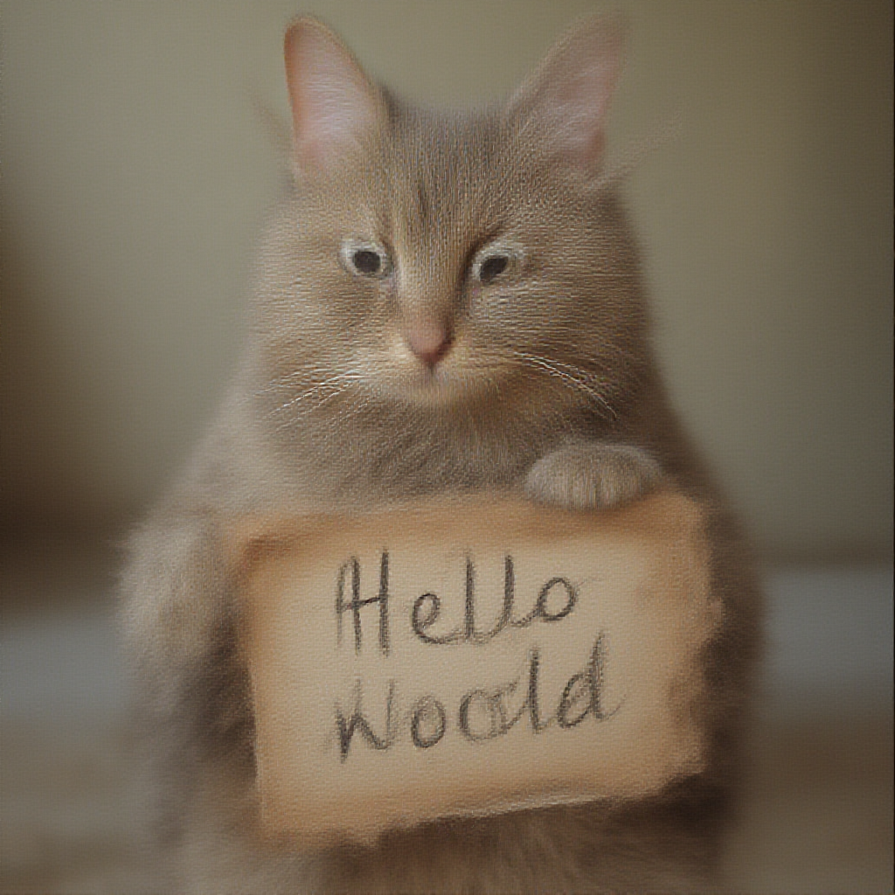

(torchao_hf_integration)=
# Hugging Face Integration

```{contents}
:local:
:depth: 2
```

(usage-examples)=
## Quick Start: Usage Example

First, install the required packages.

```bash
pip install git+https://github.com/huggingface/transformers@main
pip install git+https://github.com/huggingface/diffusers@main
pip install torchao
pip install torch
pip install accelerate
```

(quantizing-models-transformers)=
### 1. Quantizing Models with Transformers

Below is an example of using `Float8DynamicActivationInt4WeightConfig` on the Llama-3.2-1B model.

```python
from transformers import TorchAoConfig, AutoModelForCausalLM
from torchao.quantization import Float8DynamicActivationInt4WeightConfig

# Create quantization configuration
quantization_config = TorchAoConfig(
    quant_type=Float8DynamicActivationInt4WeightConfig(group_size=128, use_hqq=True)
)

# Load and automatically quantize the model
model = AutoModelForCausalLM.from_pretrained(
    "meta-llama/Llama-3.2-1B",
    torch_dtype="auto",
    device_map="auto",
    quantization_config=quantization_config
)
```
```{seealso}
For inference examples and recommended quantization methods based on different hardwares (i.e. A100 GPU, H100 GPU, CPU), see [HF-Torchao Docs (Quantization Examples)](https://huggingface.co/docs/transformers/main/en/quantization/torchao#quantization-examples).

For inference using vLLM, please see [(Part 3) Serving on vLLM, SGLang, ExecuTorch](https://docs.pytorch.org/ao/main/serving.html) for a full end-to-end tutorial.
```

(quantizing-models-diffusers)=
### 2. Quantizing Models with Diffusers

Below is an example of how we can integrate with Diffusers.

```python
from diffusers import FluxPipeline, FluxTransformer2DModel, TorchAoConfig

model_id = "black-forest-labs/Flux.1-Dev"
dtype = torch.bfloat16

quantization_config = TorchAoConfig("int8wo")
transformer = FluxTransformer2DModel.from_pretrained(
    model_id,
    subfolder="transformer",
    quantization_config=quantization_config,
    torch_dtype=dtype,
)
pipe = FluxPipeline.from_pretrained(
    model_id,
    transformer=transformer,
    torch_dtype=dtype,
)
pipe.to("cuda")

prompt = "A cat holding a sign that says hello world"
image = pipe(prompt, num_inference_steps=4, guidance_scale=0.0).images[0]
image.save("output.png")
```

```{note}
Example Output:

```

```{seealso}
Please refer to [HF-TorchAO-Diffuser Docs](https://huggingface.co/docs/diffusers/en/quantization/torchao) for more examples and benchmarking results.
```

(saving-models)=
## Saving the Model

After we quantize the model, we can save it.

```python
# Save quantized model (see below for safe_serialization enablement progress)
with tempfile.TemporaryDirectory() as tmp_dir:
    model.save_pretrained(tmp_dir, safe_serialization=False)

# optional: push to hub (uncomment the following lines)
# save_to = "your-username/Llama-3.2-1B-int4"
# model.push_to_hub(save_to, safe_serialization=False)

tokenizer = AutoTokenizer.from_pretrained("meta-llama/Llama-3.2-1B")
tokenizer.push_to_hub(save_to)
```

**Current Status of Safetensors support**: TorchAO quantized models cannot yet be serialized with safetensors due to tensor subclass limitations. When saving quantized models, you must use `safe_serialization=False`.

```python
# don't serialize model with Safetensors
output_dir = "llama3-8b-int4wo-128"
quantized_model.save_pretrained("llama3-8b-int4wo-128", safe_serialization=False)
```

**Workaround**: For production use, save models with `safe_serialization=False` when pushing to Hugging Face Hub.

**Future Work**: The TorchAO team is actively working on safetensors support for tensor subclasses. Track progress [here](https://github.com/pytorch/ao/issues/2338) and [here](https://github.com/pytorch/ao/pull/2881).

(Supported-Quantization-Types)=
## Supported Quantization Types

Weight-only quantization stores the model weights in a specific low-bit data type but performs computation with a higher-precision data type, like `bfloat16`. This lowers the memory requirements from model weights but retains the memory peaks for activation computation.

Dynamic activation quantization stores the model weights in a low-bit dtype, while also quantizing the activations on-the-fly to save additional memory. This lowers the memory requirements from model weights, while also lowering the memory overhead from activation computations. However, this may come at a quality tradeoff at times, so it is recommended to test different models thoroughly.

```{note}
Please refer to the [torchao docs](https://docs.pytorch.org/ao/main/api_ref_quantization.html) for supported quantization types.
```
