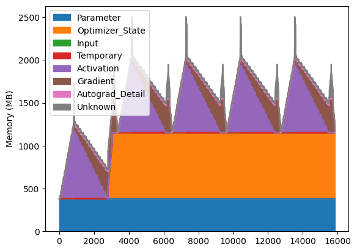
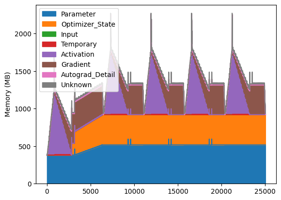

### GaLore Memory Profiler

Tests memory usage of `GaLore` optimizers.

Uses `torch.profiler` under the hood with additional options for `nsys`, [`torch.cuda.memory`](https://pytorch.org/docs/stable/torch_cuda_memory.html) analyses.

Runs an untrained Llama model with configs for various model sizes (see `configs`) from the original GaLore [repo](https://github.com/jiaweizzhao/GaLore/tree/master/configs) on a sample batch of data for a configurable set of iterations.

The results of the profiler are saved and can be analyzed using the provided notebook.

#### Examples

Run memory profiler with `torch.optim.AdamW`

```
python galore_mem_prof.py -t --optimizer=adamw
```

Run profiler with `GaLoreAdamW` reference implementation with rank 128

```
python galore_mem_prof.py -t --optimizer=galore_adamw --rank=128
```

More options

```
python test_memory_usage.py --help

usage: test_memory_usage.py [-h] [-t] [-m] [-ns] [--optimizer {adamw,galore_adamw}] [--rank RANK] [--update_proj_gap UPDATE_PROJ_GAP]
                            [--galore_scale GALORE_SCALE] [--wait_steps WAIT_STEPS] [--warmup_steps WARMUP_STEPS] [--profiler_steps PROFILER_STEPS]
                            [--max_steps MAX_STEPS] [--model_config MODEL_CONFIG] [--data_path DATA_PATH] [--output_dir OUTPUT_DIR] [-lr LEARNING_RATE]
                            [--weight_decay WEIGHT_DECAY] [--seed SEED]

options:
  -h, --help            show this help message and exit
  -t, --torch_profiler  Enable torch profiler (default: False)
  -m, --torch_memory_snapshot
                        Enable torch memory snapshot (default: False)
  -ns, --nsys_profiler  Enable nsys profiling context managerSurrounds training loop with cudaProfilerApi.{Start,Stop} (default: False)
  --optimizer {adamw,galore_adamw}
                        Which optimizer to use (default: adamw)
  --rank RANK
  --update_proj_gap UPDATE_PROJ_GAP
  --galore_scale GALORE_SCALE
  --wait_steps WAIT_STEPS
                        Number of steps to run before starting torch profiler (default: 0)
  --warmup_steps WARMUP_STEPS
                        Number of warmup steps for torch profiler (default: 0)
  --profiler_steps PROFILER_STEPS
                        Number of active steps for torch profiler (default: 5)
  --max_steps MAX_STEPS
                        Max number of train steps to run.Total train steps will be min of `max_steps` and the sum of torch profiler steps (`wait_steps` +
                        `warmup_steps` + `profiler_steps`). (default: 100)
  --model_config MODEL_CONFIG
                        Path to Llama config file see `https://github.com/jiaweizzhao/GaLore/tree/master/configs` (default: ./configs/llama_100m.json)
  --data_path DATA_PATH
                        Path to sample batch (default: ./data/sample_batch.pt)
  --output_dir OUTPUT_DIR
                        Directory for profiler outputs (default: profiler_out)
  -lr LEARNING_RATE, --learning_rate LEARNING_RATE
                        Learning rate (default: 0.001)
  --weight_decay WEIGHT_DECAY
                        Weight decay for AdamW (default: 0.01)
  --seed SEED           Random seed for torch (default: 0)
```

#### Analysis

The provided notebook `galore_memory_analysis.ipynb` can be used to load the outputs of the profiling script.

- The `profiler_out` directory contains output from a few sample runs of the profiler for `100M` config for `5` training steps (`forward` -> `backward` -> `optimizer.step`)
  - `adamw*.{json,html} - reference `torch` `AdamW`
  - `galore_adamW-128*.{json,html}` - reference `GaLoreAdamW` optimizer from the original `GaLore` repo with `rank=128`
  - `galore_adamW-64*.{json,html}` - reference `GaLoreAdamW` optimizer from the original `GaLore` repo with `rank=64`

The provided notebook has the plots and stats of the memory traces of these sample runs embedded and a cursory analysis of these sample data as follows:

- CUDA Memory Timeline

  - Plots of the html memory timeline from `torch.profiler`

    - Reference `torch.optim.AdamW`

      

    - Reference `GaLoreAdamW`

      

We can see a long delay between the first backwards step for `GaLoreAdamW` due to the calculation of the projection matrix (calls `torch.linalg.svd` on the `grad`).

- Memory Stats

  - Summary stats for the memory timeline are generated by parsing the `json` output of the torch profiler [memory trace](https://pytorch.org/docs/main/profiler.html#torch.profiler._KinetoProfile.export_memory_timeline).

    - Memory Usage (in MB) for `torch.optim.AdamW`

    |        | Parameter | Optimizer_State | Input | Temporary | Activation | Gradient | Autograd_Detail | Unknown |
    | ------ | --------- | --------------- | ----- | --------- | ---------- | -------- | --------------- | ------- |
    | mean   | 381.9     | 628.1           | 0.0   | 0.2       | 356.0      | 162.8    | 6.6             | 29.5    |
    | min    | 381.9     | 0.0             | 0.0   | 0.0       | 0.0        | 0.0      | 0.0             | 0.0     |
    | median | 381.9     | 769.6           | 0.0   | 0.0       | 337.8      | 171.7    | 3.1             | 16.3    |
    | max    | 382.0     | 769.6           | 0.3   | 6.7       | 1,338.1    | 395.7    | 312.9           | 402.8   |

    - Memory Usage (in MB) for `GaLoreAdamW` reference, rank 128

    |        | Parameter | Optimizer_State | Input | Temporary | Activation | Gradient | Autograd_Detail | Unknown |
    | ------ | --------- | --------------- | ----- | --------- | ---------- | -------- | --------------- | ------- |
    | mean   | 491.4     | 349.0           | 0.0   | 0.2       | 226.6      | 246.1    | 4.2             | 18.7    |
    | min    | 381.9     | 0.0             | 0.0   | 0.0       | 0.0        | 0.0      | 0.0             | 0.0     |
    | median | 516.3     | 403.6           | 0.0   | 0.0       | 75.7       | 272.8    | 0.0             | 18.1    |
    | max    | 595.0     | 403.6           | 0.3   | 6.6       | 1,336.0    | 395.3    | 312.9           | 173.6   |

  - The `optimizer state` is indeed smaller for the `GaLoreAdamW` optimizer. Interestingly, the `Parameter` sizes balloons in the `GaLore` optimizer, likely due to extra data copies. Admittedly, the implementation is only a reference (per original repo) and leaves much room for optimization.

  **NOTE**: The `json` output of the torch profiler memory trace is unlabeled. However, we can infer -- and confirm -- the labels by comparing the plots of the parsed dataframe with that of the direct `html` export of the profiler.
