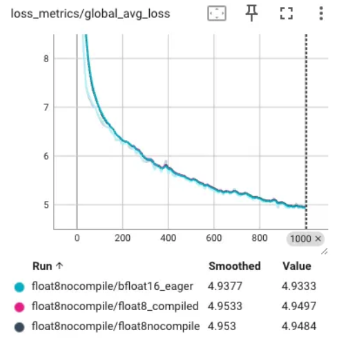

# float8nocompile


A prototype API for high performance eager mode float8 training that uses handwritten Triton kernels for quantization.

### Usage

Prepare your model for high performance eager mode float8 training with a single conversion function: `convert_to_float8_nocompile_training` ([source](https://github.com/pytorch/ao/blob/32a51eca14257bbaafd3671a5349189e30c65e2b/torchao/prototype/float8nocompile/float8nocompile_linear_utils.py#L24)).

This function will replace nn.Linear layers with Float8NoCompileLinear layers in-place, which uses **dynamic, tensorwise scaling**
to perform all matmuls in the linear layer forward and backward pass as FP8 GEMMs.

**Example**:

```python
from torchao.prototype.float8nocompile.float8nocompile_linear_utils import (
    convert_to_float8_nocompile_training,
)

# define your model, data loaders, etc
...

# convert specified `torch.nn.Linear` modules to `Float8Linear`
convert_to_float8_nocompile_training(model)

# training loop
for i in range(num_epochs):
    ...
```

### Performance benchmarks

Performance benchmarking was done via [experimental integration into torchtitan](https://github.com/pytorch/torchtitan/pull/778).

The results indicate a solid 6-10% tokens/sec speedup with relatively flat memory (+/- 1% peak memory) compared the bf16 eager baseline.

# Performance Comparison of Different Configurations on 8 H100s

## No AC (seq len 4096) - 8 H100s

| Configuration                                    | Tokens/sec | Peak memory (GB) | Tokens/sec Δ | Peak memory Δ |
|-------------------------------------------------|------------|------------------|--------------|---------------|
| bfloat16, eager                                 | 5339.0     | 53.12            | 0%           | 0.00%         |
| float8nocompile prototype                       | 5871.4     | 52.7             | 9.97%        | -0.79%        |
| float8 + torch.compile                          | 6667.6     | 46.64            | 24.88%       | -12.20%       |

---

## Selective per layer AC (AC every 2nd layer, seq len 4096) - 8 H100s

| Configuration                                    | Tokens/sec | Peak memory (GB) | Tokens/sec Δ | Peak memory Δ |
|-------------------------------------------------|------------|------------------|--------------|---------------|
| bfloat16, eager                                 | 4882.4     | 40.6             | 0%           | 0.00%         |
| float8nocompile prototype                       | 5302.0     | 40.97            | 8.59%        | 0.91%         |
| float8 + torch.compile                          | 6199.6     | 37.38            | 26.98%       | -7.93%        |

---

## Full AC (seq len 4096) - 8 H100s

| Configuration                                    | Tokens/sec | Peak memory (GB) | Tokens/sec Δ | Peak memory Δ |
|-------------------------------------------------|------------|------------------|--------------|---------------|
| bfloat16, eager                                 | 4502.0     | 28.07            | 0%           | 0.00%         |
| float8nocompile prototype                       | 4773.4     | 28.07            | 6.03%        | 0.00%         |
| float8 + torch.compile                          | 5775.2     | 28.03            | 28.28%       | -0.14%        |


## Numerical accuracy

Numerical accuracy has been verified via unit tests as well as manually verifying that the training loss curves maintain fidelity with the loss curves for bf16 eager and production float8 + torch.compile:


