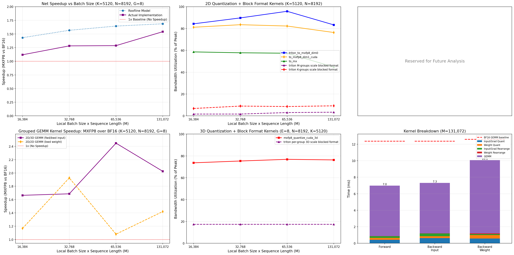
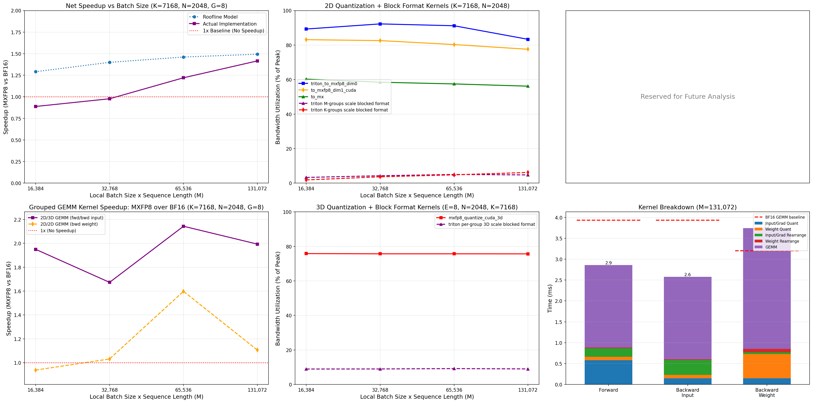

# MXFP8 MoE Training

## Table of Contents
- [Overview](#overview)
- [Case study training at scale: 1.2x e2e speedup with equivalent convergence versus to bf16](#case-study-training-at-scale-12x-e2e-speedup-with-equivalent-convergence-versus-to-bf16)
- [Examples](#examples)
- [System requirements](#system-requirements)
- [Benchmarks](#benchmarks)
  - [Autograd function](#autograd-function)
  - [Kernel Microbenchmarks: Breakdown by Pass](#kernel-microbenchmarks-breakdown-by-pass)
  - [Roofline Performance Analysis](#roofline-performance-analysis)
  - [Single MoE layer forward + backward pass](#benchmark-single-moe-layer-forward--backward-pass)
  - [End-to-end training benchmark with TorchTitan: Llama4 Scout vs bfloat16 baseline](#end-to-end-training-benchmark-with-torchtitan-llama4-scout-vs-bfloat16-baseline)
- [Implementation details for developers](#implementation-details-for-developers)
- [Limitations](#limitations)

## Overview
This prototype provides:

1. Quantized building block for low precision MoE training: [_to_mxfp8_then_scaled_grouped_mm](https://github.com/pytorch/ao/blob/53b5efdac921a38fd15e8d3ac8191c3927140287/torchao/prototype/moe_training/scaled_grouped_mm.py#L677). It is a differentiable drop-in replacement for `torch._grouped_mm` that dynamically quantizes inputs using the given recipe, performs a scaled grouped GEMM, then returns the results in original precision. See runnable [example](#torchao_scaled_grouped_mm-example-forward--backward-pass) of a forward and backward pass below.
    - Using MXFP8 on a B200 GPU, this provides:
        - **~1.4x - 1.8x speedups** over bfloat16 `torch._grouped_mm` for Llama4 Scout shapes
        - **~1.19 - 1.6x speedups** over bfloat16 `torch._grouped_mm` for DeepSeekV3 671b shapes
    - These benchmarks use `seq_len=8192`, `local_batch_size=16` (so `total_M = 8192 * 16 = 131,072`). We recommend using a large `total_M` dim to maximize speedup. See [benchmarks](#microbenchmarks) for more details.


2. [TorchTitan](https://github.com/pytorch/torchtitan/tree/main) integration: pretrain DeepSeekV3/Llama4 with MXFP8 grouped GEMMs by adding the flag to your training command: `--model.converters="quantize.grouped_mm.mx" --quantize.grouped_mm.mx.fqns="experts"`

3. Model conversion API to swap all `torch._grouped_mm` ops in your model definition to use torchao `_quantize_then_scaled_grouped_mm` under the hood (see [example](#model-conversion-api-example-end-to-end-training) below).


## Case study training at scale: 1.2x e2e speedup with equivalent convergence versus to bf16

Training runs on 64 node GB200 cluster with TorchTitan Llama4 Scout demonstrated a 1.2x e2e training speedup with equivalent convergence to bfloat16 training baseline. Infact, after 3,000 steps it finishes with slightly *lower* loss than bfloat16! This is consistent with our scaling experiments with [MXFP8 training for dense models](https://pytorch.org/blog/accelerating-2k-scale-pre-training-up-to-1-28x-with-torchao-mxfp8-and-torchtitan-on-crusoe-b200-cluster/).


| Number of GPUs | BF16 tokens/sec | MXFP8 tokens/sec | MXFP8 speedup vs BF16
| ----------------------- | --------------: | ----------------: | ---------------------: |
| 512 | 6169 | 7401 | 1.20x


Training and model configurations for this run:
- Model: Llama4 Scout
- Dataset: C4
- Sequence length: 8192
- Local batch size: 1
- Learning rate: 1e-4
- LR scheduler warmup steps: 2000
- Parallelisms (64 nodes of 4 devices each = 256 chips):
    - FSDP=256 (on attention layers, shared experts, dense layer FFNs) and 256/4=64 (on routed experts)
    - EP=16 (on routed experts)
- Activation checkpointing mode: `none` (ideally this should use selective per op AC but there was a bug at the time preventing us from using it).
- `torch.compile` enabled
- `mxfp8` applied to routed experts computation (grouped GEMMs)
- `mxfp8` applied to all linear layers except: `output`, `router.gate`, `attention.wk`, `attention.wv` (Wk and Wv too small to benefit from mxfp8)


## Examples
#### _to_mxfp8_and_scaled_grouped_mm usage
```python
import torch
from torch.nn import functional as F
from torchao.prototype.moe_training import (
    _to_mxfp8_then_scaled_grouped_mm,
)
from torchao.prototype.moe_training.utils import generate_jagged_offs

num_groups, total_M, N, K = 8, 131072, 8192, 5120

# A = input actvations, B = expert weights
A = torch.randn(total_M, K, dtype=torch.bfloat16, device="cuda", requires_grad=True)
B = torch.randn(num_groups, N, K, dtype=torch.bfloat16, device="cuda", requires_grad=True)

# Token group offsets computed by router in actual MoE layer
offs = generate_jagged_offs(num_groups, total_M, device="cuda")

# Forward and backward example (uses default MXFP8 settings)
out = _to_mxfp8_then_scaled_grouped_mm(
        A,
        B.transpose(-2, -1),
        offs,
)
# Optional: pass pre-quantized activations with:
# _to_mxfp8_then_scaled_grouped_mm(A, B_t, offs, prequantized_A=(A_qdata, A_scale))
# or pass A directly as an MXTensor.

# (Fake labels for demonstration purposes)
labels = torch.ones_like(out)
loss = F.mse_loss(out, labels)
loss.backward()
```

## System requirements
- torchao 0.14+
- For MXFP8 MoE training, CUDA 12.8+ and SM100+ GPU arch are required.
- For FP8 rowwise MoE training, CUDA 12.4+ and SM89+ GPU arch are required.


## Benchmarks

### Autograd function 
Forward + backward pass benchmarks for the [autograd function](https://github.com/pytorch/ao/blob/8bb433e989ad6f7ee0920f946d3a9be7f14be8c7/torchao/prototype/moe_training/scaled_grouped_mm.py#L284) powering MXFP8 MoE training.

#### Llama4 Scout shapes 

* `G` (number of groups/experts per device) varies from 1 to 8 to simulate different degrees of expert parallelism

| M,N,K,G                 | bf16_fwd_bwd_us | scaled_fwd_bwd_us | scaled_fwd_bwd_speedup |
| ----------------------- | --------------: | ----------------: | ---------------------: |
| (128000, 8192, 5120, 1) |        43140.20 |          23867.00 |                 1.808x |
| (128000, 8192, 5120, 2) |        39487.60 |          23359.00 |                 1.690x |
| (128000, 8192, 5120, 4) |        39189.20 |          23945.50 |                 1.637x |
| (128000, 8192, 5120, 8) |        37700.70 |          22170.60 |                 1.700x |

#### DeepSeekV3 671b shapes

* `G` (number of groups/experts per device) varies 1 to 8 to simulate different degrees of expert parallelism

| M,N,K,G                 | bf16_fwd_bwd_us | scaled_fwd_bwd_us | scaled_fwd_bwd_speedup |
| ----------------------- | --------------: | ----------------: | ---------------------: |
| (128000, 2048, 7168, 1) |        13064.80 |          10996.00 |                 1.188x |
| (128000, 2048, 7168, 2) |        14900.20 |          11283.40 |                 1.321x |
| (128000, 2048, 7168, 4) |        15823.60 |           9919.36 |                 1.595x |
| (128000, 2048, 7168, 8) |        14966.80 |          10397.20 |                 1.440x |


To reproduce this benchmark, on a B200 GPU machine, run the following command:
- `python benchmarks/prototype/moe_training/benchmark_scaled_grouped_mm_dq.py --compile`
- torchao: `0.14.0+gitc7b8e13da`
- torch: `2.10.0a0+gitf6de195`

### Kernel Microbenchmarks: Breakdown by Pass

The following table provides a detailed breakdown of all MXFP8 kernels used in the forward and backward passes, with shapes representative of **DeepSeekV3 671B** (dim=7168, hidden_dim=2048, total_tokens=131072, groups=8, block_size=32).

**Environment:**
- torch: `2.11.0.dev20260101+cu128`
- torchao: `0.16.0+gitaa38ae104`
- NVIDIA B200, 1000W limit

| Pass | Kernel | Purpose | Input Shape | Time (µs) | Efficiency |
|------|--------|---------|-------------|-----------|------------|
| **Forward** | `triton_to_mxfp8_dim0` | Quantize A (activations) along K | (131072, 7168) | 525.3 | 73.7% peak BW |
| **Forward** | `triton_to_mxfp8_dim0` | Quantize B (weights) along K | (8, 2048, 7168) | 65.4 | 74.0% peak BW |
| **Forward** | `mx_block_rearrange_2d_M_groups_cuda` | Convert A scales to blocked layout | (131072, 224) | 29.7 | — |
| **Forward** | `triton_mx_block_rearrange_per_group_3d` | Convert B scales to blocked layout | (8, 2048, 224) | 13.3 | — |
| **Forward** | `torch._scaled_grouped_mm` | 2D-3D scaled grouped GEMM | (131072, 7168) @ (8, 7168, 2048) | 1671.2 | 65.6% peak TFLOPS |
| **Backward (dA)** | `triton_to_mxfp8_dim0` | Quantize grad_out along N | (131072, 2048) | 144.4 | 76.6% peak BW |
| **Backward (dA)** | `mxfp8_quantize_cuda_3d` | Quantize B (weights) along N | (8, 2048, 7168) | 70.7 | 68.4% peak BW |
| **Backward (dA)** | `mx_block_rearrange_2d_M_groups_cuda` | Convert grad_out scales to blocked format | (131072, 64) | 19.4 | — |
| **Backward (dA)** | `triton_mx_block_rearrange_per_group_3d` | Convert B scales to blocked format | (8, 7168, 64) | 12.9 | — |
| **Backward (dA)** | `torch._scaled_grouped_mm` | 2D-3D scaled grouped GEMM | (131072, 2048) @ (8, 2048, 7168) | 1683.4 | 65.1% peak TFLOPS |
| **Backward (dB)** | `to_mxfp8_dim1_cuda` | Quantize grad_out along M (output transposed) | (131072, 2048) | 141.5 | 78.1% peak BW |
| **Backward (dB)** | `to_mxfp8_dim1_cuda` | Quantize A along M (output transposed) | (131072, 7168) | 472.2 | 81.9% peak BW |
| **Backward (dB)** | `triton_mx_block_rearrange_2d_K_groups` | Convert grad_out_t scales to blocked format | (2048, 4096) | 199.8 | — |
| **Backward (dB)** | `triton_mx_block_rearrange_2d_K_groups` | Convert A_t scales to blocked format | (7168, 4096) | 207.9 | — |
| **Backward (dB)** | `torch._scaled_grouped_mm` | 2D-2D scaled grouped GEMM | (2048, 131072) @ (131072, 7168) | 2103.3 | 52.1% peak TFLOPS |

**Notes:**
- **Efficiency** is reported as percentage of peak achievable bandwidth (for memory-bound quantization kernels) or percentage of peak TFLOPS (for compute-bound GEMM kernels)
- Scale rearrangement kernels are not conventional memory bandwidth bound or compute bound kernels, so we report absolute runtime only
- Scale tensor shapes are derived from input shapes divided by `block_size=32` along the scaling dimension
- Detailed kernel breakdown with timing for all kernels is available in the roofline plots above (generated by `roofline_unified.py`)
- All kernels can be benchmarked individually using the scripts in `benchmarks/prototype/moe_training/mxfp8/`

**Benchmark Scripts:**
| Kernel Type | Benchmark Script |
|-------------|------------------|
| 2D Quantization (dim0/dim1) | `benchmarks/mx_formats/cast_bench.py` |
| 3D Quantization | `benchmarks/prototype/moe_training/mxfp8/bench_quantize_3d.py` |
| 2D M-groups Scale Rearrange | `benchmarks/prototype/moe_training/mxfp8/bench_mx_block_rearrange_2d_M_groups.py` |
| 2D K-groups Scale Rearrange | `benchmarks/prototype/moe_training/mxfp8/bench_triton_mx_block_rearrange_2d_K_groups.py` |
| 3D Per-group Scale Rearrange | `benchmarks/prototype/moe_training/mxfp8/bench_triton_mx_block_rearrange_per_group_3d.py` |
| Unified Benchmarks and Rooflines | `benchmarks/prototype/moe_training/mxfp8/roofline_unified.py` |


### Roofline Performance Analysis

The following roofline plots provide roofline analysis and benchmarks for the following:

1. **Net Speedup vs () Size** - MXFP8 vs BF16 for forward + backward pass
2. **2D Quantization + Block Format Kernels** - Bandwidth utilization for input quantization and per-group scale conversion to blocked format
3. **3D Quantization + Block Format Kernels** - Bandwidth utilization for weight quantization and per-group scale conversion to blocked format
4. **Grouped GEMM Kernel Speedup** - MXFP8 over BF16 for 2D/3D and 2D/2D GEMM operations
5. **Kernel Breakdown** - Stacked bar chart showing actual measured times for each kernel component (quantization, conversion to blocked format, GEMM) across forward, backward input, and backward weight passes

These benchmarks were generated on **November 26, 2025** and will be updated with every change that affects performance.

Next steps for optimization:
* Improve 2D-2D MXFP8 grouped GEMM CUTLASS kernel performance (used for computing wgrad), which currently produces much lower speedups than the 2D-3D case (used for computing output and dgrad).

#### Llama4 Shapes (K=5120, N=8192, G=8)



**Command to reproduce:**
```bash
cd benchmarks/prototype/moe_training/mxfp8
python roofline_unified.py --K=5120 --N=8192 --G=8 --power_limit_percent=100 --breakdown_M=131072 --plot_file=llama_rooflines.png
```

#### DeepSeek V3 Shapes (K=7168, N=2048, G=8)



**Command to reproduce:**
```bash
cd benchmarks/prototype/moe_training/mxfp8
python roofline_unified.py --K=7168 --N=2048 --G=8 --power_limit_percent=100 --breakdown_M=131072 --plot_file=dsv3_rooflines.png
```

### Single MoE layer forward + backward pass

| Model        | total_M | N    | K    | bf16 time (ms) | mxfp8 time (ms) | speedup |
|--------------|---------|------|------|---------------|-----------------|---------|
| Llama4 16e   | 131072  | 8192 | 5120 | 275.270       | 192.420         | 1.431x  |
| DeepSeekV3   | 131072  | 2048 | 7168 | 92.032        | 80.182          | 1.148x  |

To reproduce these benchmarks, on a B200 GPU machine, run the following commands:

Llama4 17b 16e shapes:
```bash
CUDA_VISIBLE_DEVICES=6 python benchmarks/prototype/moe_training/bench_moe_layer.py --recipe mxfp8_rceil --local_batch_size=16 --dim=5120 --hidden_dim=8192 --local_num_experts=8
```

DeepSeekV3 671b shapes:
```bash
CUDA_VISIBLE_DEVICES=6 python benchmarks/prototype/moe_training/bench_moe_layer.py --recipe mxfp8_rceil --local_batch_size=16 --dim=7168 --hidden_dim=2048 --local_num_experts=8
```


### End-to-end training benchmark with TorchTitan: Llama4 Scout vs bfloat16 baseline
- Single node benchmarks with 4xB200
- Llama4 16e default configs; FSDP=4, EP=4; AC=none; compile=True; seq_len=8192; local_bs=8
- Reduced num layers from 48 -> 2 to avoid OOM in single node setting
- TorchTitan debug model config (same as Llama4 17bx16e, but with 2 layers):


| Configuration                                                              | Throughput (Median Tokens/s) | Max Memory (GiB) | Speedup over bf16
|:---------------------------------------------------------------------------|-----------------------------:|------------------|------------------|
| bf16 baseline                                                              |                      49381.0 |           145.55 | -
| MXFP8 for Linears only                                                     |                      52038.0 |           146.62 | 1.053x
| MXFP8 for Grouped GEMMs only                                               |                      69350.0 |           144.71 | 1.404x
| MXFP8 for Linears + Grouped GEMMs                                          |                      70747.0 |           145.32 | 1.433x

#### Commands to reproduce these benchmarks:

bfloat16 baseline:
```
rm -rf /tmp/torchinductor_${USER}; CUDA_VISIBLE_DEVICES="4,5,6,7" TORCHTITAN_ROOT=/home/${USER}/torchtitan NGPU=4 EXTRA_ARGS="--metrics.log_freq=10 --training.steps=200  --parallelism.data_parallel_shard_degree=4 --parallelism.expert_parallel_degree=4 --parallelism.tensor_parallel_degree=1 --compile.enable --training.seq_len=8192 --activation_checkpoint.mode=none --model.print_after_conversion" ./llama4.sh
```

MXFP8 dense only:
```
rm -rf /tmp/torchinductor_${USER}; CUDA_VISIBLE_DEVICES="4,5,6,7" TORCHTITAN_ROOT=/home/${USER}/torchtitan NGPU=4 EXTRA_ARGS="--metrics.log_freq=10 --training.steps=200  --parallelism.data_parallel_shard_degree=4 --parallelism.expert_parallel_degree=4 --parallelism.tensor_parallel_degree=1 --compile.enable --training.seq_len=8192 --activation_checkpoint.mode=none --model.print_after_conversion --model.converters="quantize.linear.mx"" ./llama4.sh
```

MXFP8 MoE only:
```
rm -rf /tmp/torchinductor_${USER}; CUDA_VISIBLE_DEVICES="4,5,6,7" TORCHTITAN_ROOT=/home/${USER}/torchtitan NGPU=4 EXTRA_ARGS="--metrics.log_freq=10 --training.steps=200  --parallelism.data_parallel_shard_degree=4 --parallelism.expert_parallel_degree=4 --parallelism.tensor_parallel_degree=1 --compile.enable --training.seq_len=8192 --activation_checkpoint.mode=none --model.print_after_conversion --model.converters="quantize.grouped_mm.mx"" ./llama4.sh
```

MXFP8 MoE + Dense:
```
rm -rf /tmp/torchinductor_${USER}; CUDA_VISIBLE_DEVICES="4,5,6,7" TORCHTITAN_ROOT=/home/${USER}/torchtitan NGPU=4 EXTRA_ARGS="--metrics.log_freq=10 --training.steps=50  --parallelism.data_parallel_shard_degree=4 --parallelism.expert_parallel_degree=4 --parallelism.tensor_parallel_degree=1 --compile.enable --training.seq_len=8192 --activation_checkpoint.mode=none --model.print_after_conversion --model.converters="quantize.grouped_mm.mx,quantize.linear.mx"" ./llama4.sh
```


## Implementation details for developers
This prototype is specifically designed to be used on MoE models using
`torch._grouped_mm` to implement expert computation in token-choice routing,
where expert weights are implemented as 3D nn.Parameters with `num_experts` as
the leading dim.

The `MXFP8GroupedMMConfig` has a module handler registered to it which will
find all nn.Parameters whose parent module matches the module filter function,
and swap their data tensor with a ScaledGroupedMMTensor.

The ScaledGroupedMMTensor is a tensor subclass which overrides the
`torch._grouped_mm` op by dispatching to a differentiable scaled grouped mm,
which performs dynamic quantization on scaled grouped GEMM operands in both 
the forward and backward pass, based on the quantization config (FP8/MXFP8/etc).

For all other ops, ScaledGroupedMMTensor behaves like a regular torch.Tensor.

## Limitations
- The new CUDA kernel for MXFP8 quantization of the non-transposed expert weights in the backwards pass does not support TP yet.
