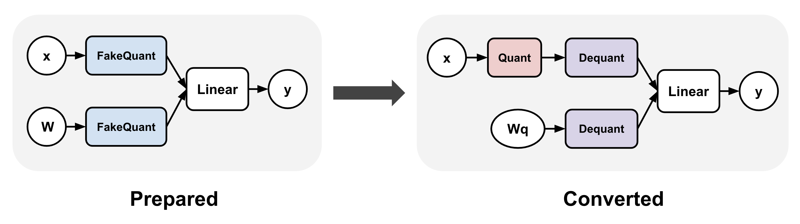

# Quantization-Aware Training (QAT)

Quantization-Aware Training (QAT) refers to applying fake quantization during the
training or fine-tuning process, such that the final quantized model will exhibit
higher accuracies and perplexities. Fake quantization refers to rounding the float
values to quantized values without actually casting them to dtypes with lower
bit-widths, in contrast to post-training quantization (PTQ), which does cast the
quantized values to lower bit-width dtypes, e.g.:

```
# PTQ: x_q is quantized and cast to int8
# scale and zero point (zp) refer to parameters used to quantize x_float
# qmin and qmax refer to the range of quantized values
x_q = (x_float / scale + zp).round().clamp(qmin, qmax).cast(int8)

# QAT: x_fq is still in float
# Fake quantize simulates the numerics of quantize + dequantize
x_fq = (x_float / scale + zp).round().clamp(qmin, qmax)
x_fq = (x_fq - zp) * scale
```

QAT typically involves applying a transformation to your model before and after training.
In torchao, these are represented as the prepare and convert steps: (1) prepare inserts
fake quantize operations into linear layers, and (2) convert transforms the fake quantize
operations to actual quantize and dequantize operations after training, thereby producing
a quantized model (dequantize operations are typically fused with linear after lowering).
Between these two steps, training can proceed exactly as before.




## torchao APIs

torchao currently supports two QAT APIs, one through the [`quantize_`](https://pytorch.org/ao/stable/generated/torchao.quantization.quantize_.html#torchao.quantization.quantize_)
API (recommended) and one through the Quantizer classes (legacy). The `quantize_` API
allows flexible configuration of quantization settings for both activations and weights,
while the Quantizer classes each hardcode a specific quantization setting.

For example, running QAT on a single GPU:

```python
import torch
from torchtune.models.llama3 import llama3

# Set up smaller version of llama3 to fit in a single GPU
def get_model():
    return llama3(
        vocab_size=4096,
        num_layers=16,
        num_heads=16,
        num_kv_heads=4,
        embed_dim=2048,
        max_seq_len=2048,
    ).cuda()

# Example training loop
def train_loop(m: torch.nn.Module):
    optimizer = torch.optim.SGD(m.parameters(), lr=0.001, momentum=0.9, weight_decay=1e-5)
    loss_fn = torch.nn.CrossEntropyLoss()
    for i in range(10):
        example = torch.randint(0, 4096, (2, 16)).cuda()
        target = torch.randn((2, 16, 4096)).cuda()
        output = m(example)
        loss = loss_fn(output, target)
        loss.backward()
        optimizer.step()
        optimizer.zero_grad()
```


### quantize_ API (recommended)

The recommended way to run QAT in torchao is through the `quantize_` API.

1. **Prepare:** The main [`QATConfig`](https://docs.pytorch.org/ao/main/generated/torchao.quantization.qat.QATConfig.html)
accepts a post-training quantization (PTQ) config and automatically infers
the corresponding fake quantization configs to use.
2. **Convert:** quantize the model using the base config provided

Currently only the following PTQ base configs are supported:
- [`Int8DynamicActivationInt4WeightConfig`](https://docs.pytorch.org/ao/main/generated/torchao.quantization.Int8DynamicActivationInt4WeightConfig.html)
- [`Int4WeightOnlyConfig`](https://docs.pytorch.org/ao/main/generated/torchao.quantization.Int4WeightOnlyConfig.html)

For example (most use cases):

```python
from torchao.quantization import quantize_, Int8DynamicActivationInt4WeightConfig
from torchao.quantization.qat import QATConfig

model = get_model()

# prepare: swap `torch.nn.Linear` -> `FakeQuantizedLinear`
base_config = Int8DynamicActivationInt4WeightConfig(group_size=32)
quantize_(model, QATConfig(base_config, step="prepare"))

# train (not shown)

# convert: swap `FakeQuantizedLinear` -> `torch.nn.Linear`, then quantize using `base_config`
quantize_(model, QATConfig(base_config, step="convert"))

# inference or generate
```

The `quantize_` API also allows more general quantization settings that
may not have a corresponding PTQ base config, e.g. for experimentation
purposes. Users can specify custom fake quantization configs for activations
and/or weights. For example, the following usage is numerically equivalent
to the above:

```python
from torchao.quantization import quantize_, Int8DynamicActivationInt4WeightConfig
from torchao.quantization.qat import IntxFakeQuantizeConfig, QATConfig

model = get_model()

# prepare: swap `torch.nn.Linear` -> `FakeQuantizedLinear`
activation_config = IntxFakeQuantizeConfig(torch.int8, "per_token", is_symmetric=False)
weight_config = IntxFakeQuantizeConfig(torch.int4, group_size=32)
qat_config = QATConfig(
    activation_config=activation_config,
    weight_config=weight_config,
    step="prepare",
)
quantize_(model, qat_config)

# train (not shown)

# convert: (not shown, same as before)
```

To fake quantize embedding in addition to linear, you can additionally call
the following with a filter function during the prepare step:

```
# First apply linear transformation to the model as above
# Then apply weight-only transformation to embedding layers
# (activation fake quantization is not supported for embedding layers)
qat_config = QATConfig(weight_config=weight_config, step="prepare")
quantize_(m, qat_config, filter_fn=lambda m, _: isinstance(m, torch.nn.Embedding))
```


### Quantizer API (legacy)

Alternatively, torchao provides a few hardcoded quantization settings through
the following Quantizers, but these may be removed soon:
- [Int8DynActInt4QATQuantizer](https://docs.pytorch.org/ao/main/generated/torchao.quantization.qat.Int8DynActInt4WeightQATQuantizer.html#torchao.quantization.qat.Int8DynActInt4WeightQATQuantizer) (linear), targeting int8 per-token dynamic asymmetric activation + int4 per-group symmetric weight
- [Int4WeightOnlyQATQuantizer](https://docs.pytorch.org/ao/main/generated/torchao.quantization.qat.Int4WeightOnlyQATQuantizer.html#torchao.quantization.qat.Int4WeightOnlyQATQuantizer) (linear), targeting int4 per-group asymmetric weight using the efficient [int4 tinygemm kernel](https://github.com/pytorch/pytorch/blob/a672f6c84e318bbf455f13dfdd3fd7c68a388bf5/aten/src/ATen/native/cuda/int4mm.cu#L1097) after training)
- [Int4WeightOnlyEmbeddingQATQuantizer](https://docs.pytorch.org/ao/main/generated/torchao.quantization.qat.Int4WeightOnlyEmbeddingQATQuantizer.html#torchao.quantization.qat.Int4WeightOnlyEmbeddingQATQuantizer) (embedding), targeting int4 per-group symmetric weight

For example:
```python
from torchao.quantization.qat import Int8DynActInt4WeightQATQuantizer
qat_quantizer = Int8DynActInt4WeightQATQuantizer(group_size=32)
model = get_model()

# prepare: insert fake quantization ops
# swaps `torch.nn.Linear` with `Int8DynActInt4WeightQATLinear`
model = qat_quantizer.prepare(model)

# train
train_loop(model)

# convert: transform fake quantization ops into actual quantized ops
# swaps `Int8DynActInt4WeightQATLinear` with `Int8DynActInt4WeightLinear`
model = qat_quantizer.convert(model)

# inference or generate
```

To use multiple Quantizers in the same model for different layer types,
users can also leverage the [ComposableQATQuantizer](https://docs.pytorch.org/ao/main/generated/torchao.quantization.qat.ComposableQATQuantizer.html#torchao.quantization.qat.ComposableQATQuantizer)
as follows:

```python
from torchao.quantization.qat import (
    ComposableQATQuantizer,
    Int4WeightOnlyEmbeddingQATQuantizer,
    Int8DynActInt4WeightQATQuantizer,
)

quantizer = ComposableQATQuantizer([
    Int8DynActInt4WeightQATQuantizer(groupsize=group_size),
    Int4WeightOnlyEmbeddingQATQuantizer(group_size=group_size),
])

# prepare + train + convert as before
model = qat_quantizer.prepare(model)
train_loop(model)
model = qat_quantizer.convert(model)
```

## torchtune integration

torchao QAT is integrated with [torchtune](https://github.com/pytorch/torchtune)
to allow users to run quantized-aware fine-tuning as follows:

```
tune run --nproc_per_node 8 qat_distributed --config llama3/8B_qat_full
```

torchtune also supports a [QAT + LoRA distributed training recipe](https://github.com/pytorch/torchtune/blob/main/recipes/qat_lora_finetune_distributed.py)
that is 1.89x faster and uses 36.1% memory compared to vanilla QAT in our early experiments.
You can read more about it [here](https://dev-discuss.pytorch.org/t/speeding-up-qat-by-1-89x-with-lora/2700):

```
tune run --nnodes 1 --nproc_per_node 4 qat_lora_finetune_distributed --config llama3/8B_qat_lora
```

For more detail, please refer to [this QAT tutorial](https://pytorch.org/torchtune/main/tutorials/qat_finetune.html).

## Axolotl integration

[Axolotl](https://github.com/axolotl-ai-cloud) uses torchao to support quantized-aware fine-tuning. You can use the following commands to fine-tune, and then quantize a Llama-3.2-3B model:

```bash
axolotl train examples/llama-3/3b-qat-fsdp2.yaml
# once training is complete, perform the quantization step
axolotl quantize examples/llama-3/3b-qat-fsdp2.yaml
# you should now have a quantized model saved in ./outputs/qat_out/quatized
```

Please see the [QAT documentation](https://docs.axolotl.ai/docs/qat.html) in axolotl for more details.

## Evaluation Results

Evaluation was performed on 6-8 A100 GPUs (80GB each) using the torchtune QAT
integration described above. We fine-tune [Llama3-8B](https://huggingface.co/meta-llama/Meta-Llama-3-8B-Instruct)
on the [C4 dataset](https://huggingface.co/datasets/allenai/c4) (en subset)
for 5000 steps using a group size of 256 for the weights. Note that extensive
hyperparameter tuning may further improve these results.

Results for int8 per token dynamic activations + int4 per group weights, using a learning rate of 2e-5:

|                  | hellaswag<br>(acc) | hellaswag<br>(acc_norm) | wikitext<br>(word_perplexity) | wikitext<br>(byte_perplexity) | wikitext<br>(bits_per_byte) |
| ---------------- | ------ | ------ | ------ | ------ | ------ |
| No quantization  | 57.86% | 76.60% | 8.905  | 1.505  | 0.590  |
| PTQ              | 51.74% | 70.66% | 11.878 | 1.588  | 0.668  |
| QAT (quantized)  | 57.25% | 76.51% | 9.859  | 1.534  | 0.617  |
| PTQ degradation  | -6.11% | -5.94% | +2.973 | +0.083 | +0.078 |
| QAT degradation  | -0.61% | -0.21% | +0.947 | +0.029 | +0.027 |

Results for int4 per group weights, using a learning rate of 2e-6. For this quantization scheme, the
quantized path uses the more efficient [int4 tinygemm kernel](https://github.com/pytorch/pytorch/blob/a672f6c84e318bbf455f13dfdd3fd7c68a388bf5/aten/src/ATen/native/cuda/int4mm.cu#L1097).

|                  | hellaswag<br>(acc) | hellaswag<br>(acc_norm) | wikitext<br>(word_perplexity) | wikitext<br>(byte_perplexity) | wikitext<br>(bits_per_byte) |
| ---------------- | -------- | ------- | ------ | ------ | ------ |
| No quantization  | 57.16%  | 77.02% | 8.858  | 1.504  | 0.589  |
| PTQ              | 55.06%  | 74.24% | 10.311 | 1.547  | 0.630  |
| QAT (quantized)  | 55.86%  | 75.06% | 10.134 | 1.542  | 0.625  |
| PTQ degradation  | -2.10%  | -2.78% | +1.453 | +0.043 | +0.041 |
| QAT degradation  | -1.30%  | -1.96% | +1.276 | +0.038 | +0.036 |

For more details, please refer to [this blog post](https://pytorch.org/blog/quantization-aware-training).
